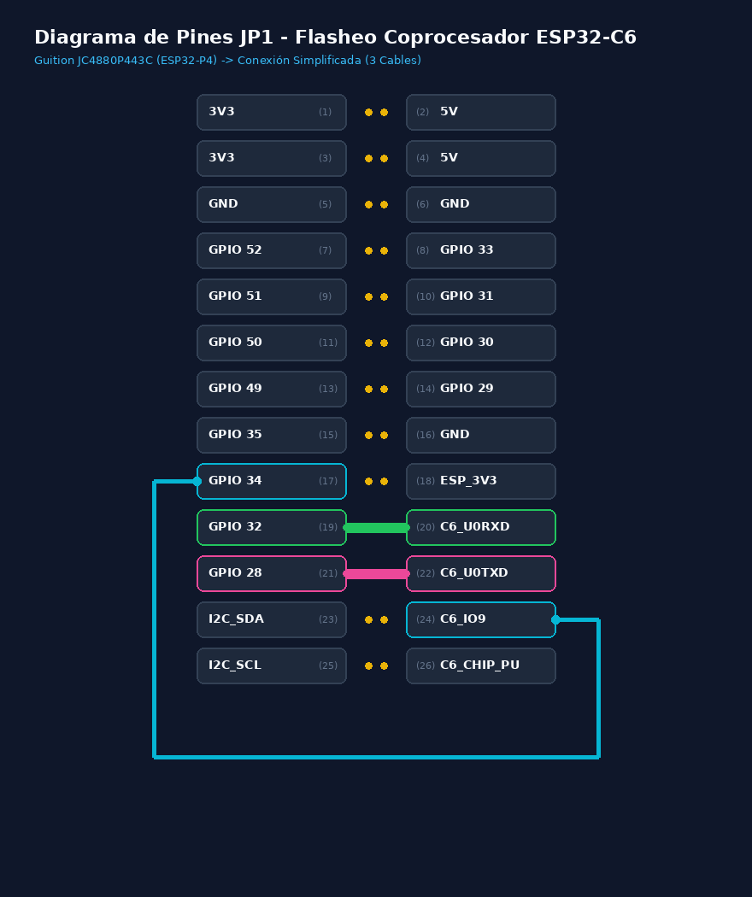

# CyBerDeck OS — CBDos v0.2.3-dev

**CyBerDeck OS (CBDos)** es un sistema operativo embebido modular, agnostico y *offline-first* disenado para cyberdecks, consolas portatiles y dispositivos multimedia basados en microcontroladores ESP32. Incluye soporte para topologias de red federadas, jerarquicas y ruteadas (basadas en Torres/Zonas). Arquitectura `core/` desacoplada de cualquier SDK de hardware, UI en **LVGL v9.5** y soporte multi-target simultaneo.

> **Estado general:** CBDos v0.2.3-dev. El nucleo `core/`, motor de UI, audio, emuladores, terminales, malla mesh, seguridad FIDO2 y todas las vistas principales estan implementados y operativos. Soporte completo multi-target ESP32-P4 y ESP32-S3.

---

## Arquitectura Modular (Core / HAL / BSP)

```
+--------------------------------------------------------------------------+
|  APLICACIONES & UI                                                        |
|  Dashboard · Config · WiFi · Storage · Wallpaper · Music · Radio          |
|  FileManager · TextEditor · Terminal · SerialTerminal · Flasher           |
|  Cartridge · Gallery · LuaRunner · LuappView · LottieTest                 |
|  MeshConfig · NetworkManager · PowerConfig · TimeConfig                   |
|  TlvBrowser · RadioConfig · Utilities (Calc/Stopwatch/Pomodoro/Todo)      |
+--------------------------------------------------------------------------+
|  CBDos API                                                                |
|  UIManager · ThemeEngine · WallpaperManager · AudioPlayer (Helix MP3)     |
|  RadioManager · WavPlayer · WavRecorder · LuaEngine · LuappManager        |
|  HidManager · DuckyInterpreter · CartridgeManager · MeshEngine            |
|  KerberosManager (FIDO2/U2F) · SSH Client · PowerManager · ConfigManager  |
|  TimeManager · SerialStreamAdapter · SshStreamAdapter                     |
+--------------------------------------------------------------------------+
|  HAL Interfaces                                                           |
|  AudioHAL · StorageHAL · NetworkHAL · SystemHAL · DisplayHAL · TouchHAL   |
|  InputHAL · FlasherHAL · HIDHAL · HTTPHAL · MeshHAL · RadioHAL            |
|  SocketHAL · SSHHAL · UARTHAL · PersistenceHAL                            |
|  100% agnostico — sin dependencias directas a ESP-IDF ni Arduino.h        |
+----------------------------------+-------------------+-------------------+
|  BSP: ESP32-P4                    |  BSP: ESP32-S3    |                   |
|  bsp/esp32_p4_jc4880             |  bsp/esp32_s3_jc3248                  |
|  ESP-IDF 5.5 / CMake / Ninja     |  PlatformIO + Arduino (pioarduino)    |
+----------------------------------+-------------------+-------------------+
```

---

## Dispositivos y Targets Oficiales

### Guition JC4880P443C — `bsp/esp32_p4_jc4880` *(target principal)*

| Componente | Detalle |
|:---|:---|
| **SoC** | ESP32-P4 RISC-V Dual-Core @ 400 MHz (Chip Rev 1.3) |
| **Memoria** | 16 MB Flash · 32 MB Hexal-PSRAM |
| **Pantalla** | 4.3" IPS 480x800 MIPI-DSI (ST7701S) @ 60 FPS |
| **Tactil** | Goodix GT911 (I2C SDA=7, SCL=8, RST=3, INT=4) |
| **Audio** | Everest ES8311 (I2C + I2S MCLK=13 BCLK=12 WS=10 DOUT=9) · Amp PA=11 |
| **Almacenamiento** | MicroSD Slot 0 SDMMC 4-bit (GPIO 39-44) + LDO VO4 3.3 V |
| **Coprocesador** | ESP32-C6-MINI (Wi-Fi 6 / BT 5) via SDIO Slot 1 |
| **Framework** | ESP-IDF 5.5 nativo (CMake / Ninja) |

### Guition JC3248W535 — `bsp/esp32_s3_jc3248`

| Componente | Detalle |
|:---|:---|
| **SoC** | ESP32-S3 Xtensa Dual-Core @ 240 MHz |
| **Memoria** | 16 MB Flash · 8 MB PSRAM |
| **Pantalla** | 3.5" IPS 320x480 QSPI (AXS15231B) @ 30 FPS |
| **Audio** | PDM TX / Helix MP3 · MicroSD SPI |
| **Framework** | PlatformIO + Arduino Core (pioarduino) |

---

## Estado de Modulos

| Modulo / Vista | Descripcion | Estado | S3 | P4 |
|:---|:---|:---:|:---:|:---:|
| **Core UI Engine** | `BaseView`, `UIManager`, ciclo de vida de vistas — LVGL 9.5 | ✅ | ✅ | ✅ |
| **Theme Engine** | Paletas dinamicas: Cyberpunk · Dark · Light · Acentos | ✅ | ✅ | ✅ |
| **Wallpaper Engine** | Fondos dinamicos en PSRAM + `WallpaperConfigView` | ✅ | ✅ | ✅ |
| **Dashboard View** | Pantalla principal tipo Cyberdeck + accesos directos | ✅ | ✅ | ✅ |
| **Config View** | Menu maestro de ajustes del sistema | ✅ | ✅ | ✅ |
| **WiFi Config View** | Escaneo, conexion y gestion de credenciales | ✅ | ✅ | 🟡 via C6 |
| **Storage Config View** | Diagnostico de particiones, MicroSD, LittleFS | ✅ | ✅ | 🟡 SDMMC |
| **Audio Core (Helix)** | Decodificador MP3/AAC/WAV/FLAC Helix en PSRAM + buffer I2S | ✅ | ✅ | ✅ |
| **Music Player View** | UI de reproductor: lista, scrubber, volumen, caratulas | ✅ | ✅ | ✅ |
| **Audio Recorder View** | Grabacion de audio con VU meter y nomenclatura de archivos | ✅ | ✅ | ✅ |
| **Radio View** | Radio por internet, lista de emisoras, streaming | ✅ | ✅ | ✅ |
| **Radio Config View** | Configuracion de radio 2.4 GHz, escaneo, seleccion de canal | ✅ | ✅ | ✅ |
| **File Manager View** | Explorador de archivos universal MicroSD/Flash | ✅ | ✅ | ✅ |
| **Text Editor View** | Editor de texto con numeracion de lineas y guardado | ✅ | ✅ | ✅ |
| **Terminal View** | Consola serial interactiva con historial | ✅ | ✅ | ✅ |
| **Serial Terminal View** | Terminal UART para routers, sensores y debug | ✅ | ✅ | ✅ |
| **Flasher View** | Programador de campo autonomo (USB-C y UART) | ✅ | ➖ | ✅ |
| **Cartridge View** | Ejecutor de juegos/cartuchos retro (GBC, NES, DOOM) | ✅ | ✅ | ✅ |
| **Lua Runner View** | Ejecutor de scripts Lua con logging y output | ✅ | ✅ | ✅ |
| **Lua++ (Luapp) View** | VM Lua aislada por-app con bindings LVGL nativos | ✅ | ✅ | ✅ |
| **Lottie Test View** | Animaciones Lottie vectoriales embebidas y desde SD | ✅ | ✅ | ✅ |
| **Gallery View** | Visor de imagenes desde MicroSD | ✅ | ✅ | ✅ |
| **Mesh Config View** | Configuracion de nodo mesh: ID, canal, potencia TX | ✅ | ✅ | ✅ |
| **Network Manager View** | Escaneo WiFi, conexion y estado de red | ✅ | ✅ | ✅ |
| **Power Config View** | Modo suspension, timer auto-off, brillo | ✅ | ✅ | ✅ |
| **Time Config View** | Servidor NTP, zona horaria, horario de verano | ✅ | ✅ | ✅ |
| **TLV Browser View** | Navegador de protocolo TLV sobre ESP-NOW/WiFi | ✅ | ✅ | ✅ |
| **Utilities View** | Utilidades: Calculadora, Stopwatch, Pomodoro, Todo | ✅ | ✅ | ✅ |
| **USB HID / BadUSB Engine** | Teclado + Ratón compuesto, DuckyScript (`.dd`) y Lua reactivo | ✅ | ✅ | ✅ |
| **USB Host CDC** | Perifericos Plug & Play por puerto USB-C (modems, radios, serial) | ✅ | ➖ | ✅ |
| **Mesh Routing Engine** | Direccionamiento IPv4 Mesh, Short IDs, Pseudo-ARP | ✅ | ✅ | ✅ |
| **SSH Client** | Terminal SSH embebida con autenticacion por llaves | ✅ | ✅ | ✅ |
| **Kerberos FIDO2/U2F** | Seguridad: CTAP2, CTAPHID, U2F, COSE, CBOR, attestacion | ✅ | ⏳ | ✅ |
| **Backpack Manager** | Auto-deteccion NFC, reconfiguracion dinamica de GPIOs en JP1 | ✅ 90% | ⏳ | ✅ |
| **Lottie Animations** | Motor de animaciones vectoriales con robot mascot | ✅ | ✅ | ✅ |
| **Synth Sound Engine** | Motor de sintesis y generador de ondas | 📋 Planificado | ⏳ | ⏳ |
| **System Info Monitor** | Monitor de RAM, Heap, FPS y temperatura en tiempo real | ⏳ Pendiente | ⏳ | ⏳ |

*Leyenda: ✅ Operativo · 🟡 Integracion de driver en curso · 📋 Planificado · ⏳ Pendiente · ➖ No aplica*

---

## Componentes UI Reutilizables

| Componente | Descripcion |
|:---|:---|
| `AnimatedWallpaper` | Fondos de pantalla animados con transiciones |
| `HeaderBar` | Barra de cabecera estandar para todas las vistas |
| `QuickSettingsPanel` | Panel de ajustes rapidos deslizante |
| `RobotMascotWidget` | Mascota animada del sistema con expresiones Lottie |
| `TerminalDisplay` | Widget de visualizacion de terminal con scroll |
| `TerminalCommandBar` | Barra de entrada de comandos de terminal |
| `SerialControlBar` | Controles de conexion/desconexion serial |
| `SshControlBar` | Controles de sesion SSH |

---

## Modales

| Modal | Descripcion |
|:---|:---|
| `AboutModal` | Informacion del sistema y creditos |
| `C6FlasherModal` | Flasheo del coprocesador ESP32-C6 |
| `DiagnosticsModal` | Diagnostico de hardware en tiempo real |
| `SshConnectModal` | Formulario de conexion SSH con autenticacion |

---

## Apps Lua++ (`apps/`)

CBDos incluye un formato de micro-aplicaciones `.luapp` con VM aislada por app y bindings nativos a las APIs del sistema:

| App | Descripcion |
|:---|:---|
| `cbd_paint.luapp` | Aplicacion de pintura y dibujo |
| `sensor_monitor.luapp` | Monitor de sensores en tiempo real |
| `serial_beacon.luapp` | Beacon de transmision serial |


> Ver [`specs/api/luapp_specification.md`](specs/api/luapp_specification.md) para el formato completo de Lua++.

---

## Cartuchos y Emuladores (`cartridges/`)

Motor de cartuchos retro con emuladores nativos para ESP32-P4:

| Cartucho | Descripcion |
|:---|:---|
| `esp32_p4_doom/` | DOOM (id Software) — puerto nativo para P4 |
| `esp32_p4_gbc/` | Game Boy Color — emulador Peanut GB |
| `esp32_p4_nes/` | NES — emulador para P4 |
| `esp32_p4_lua/` | Lua Engine — ejecucion de scripts Lua en P4 |
| `common_lua_engine/` | Motor Lua compartido: CbdApi, PICO-8 API, VirtualKeyboard, AsyncFS |

Los binarios pre-compilados se encuentran en `cartridges/bin/` y `bin/`.

---

## Backpack Manager — Mochilas Modulares con Auto-Deteccion por NFC

CBDos incluye un subsistema de hardware modular denominado **Backpack Manager** que permite acoplar "mochilas" o cartuchos fisicos de expansion en la parte trasera del Cyberdeck con deteccion inteligente instantanea:

```
+------------------------------------------------------------------------+
|               MOCHILA / CARTUCHO MODULAR DE EXPANSION                   |
|   [ Circuito: LoRa SX1262 / Sub-GHz CC1101 / Sensores / Bateria ]      |
|   Tag NFC (NTAG213) con ID de Hardware, Mapa de Pines y Lua App        |
+-----------------------------------+------------------------------------+
                                    | Acoplamiento Magnetico / Fisico
                                    v
+------------------------------------------------------------------------+
|                      CYBERDECK ESP32-P4 (CBDos)                        |
|   1. Lector NFC detecta el Tag en <15 ms y extrae el descriptor.       |
|   2. Dynamic PinMux Engine reconfigura pines SPI, I2C, UART en JP1.    |
|   3. Sistema lanza notificacion visual y ejecuta la Lua App asociada.  |
|   4. Al desacoplar, libera recursos y pone los GPIOs en estado seguro. |
+------------------------------------------------------------------------+
```

- **Auto-Identificacion por NFC (Plug & Play Fisico):** Al acercar y fijar una mochila modular (LoRa, Sub-GHz CC1101, GPS, estacion meteorologica, osciloscopio o bateria inteligente), el lector NFC lee el descriptor de hardware embebido.
- **Dynamic PinMux (Reconfiguracion de Pines al Vuelo):** El sistema asigna automaticamente los pines de la cabecera **JP1 (2x13 pines)** a las funciones necesarias (SPI MOSI/MISO/SCK/CS, buses I2C SDA/SCL, interrupciones IRQ o UART) segun lo que especifique la etiqueta NFC.
- **Auto-Lanzamiento de Aplicaciones Lua:** Abre instantaneamente la interfaz grafica y controladores de la mochila desde la MicroSD (`/sdcard/apps/*.lua`) con una animacion tactil en pantalla.
- **Hot-Swap Seguro:** Al retirar la mochila, CBDos desconecta el bus, limpia la memoria y coloca los pines en alta impedancia (Hi-Z) para evitar cortocircuitos.

---

## Soporte USB Host CDC — Modems y Perifericos Plug & Play por USB-C

CBDos incorpora soporte nativo para **USB Host CDC-ACM en ESP32-P4**, permitiendo conectar perifericos externos y dispositivos de comunicaciones directamente a traves del **puerto USB-C**:

- **Plug & Play Real (Cero Soldaduras ni Cableado):** Conexion instantanea utilizando unicamente un cable USB-C estandar. Sin necesidad de soldar pines GPIO, usar protoboards ni cableados complejos.
- **Modems, Radios y Perifericos CDC Soportados:**
  - **Dongles y Puentes de Radio (ESP32-C3 / S3 / C6):** Puentes ESP-NOW USB Bridge, transceptores LoRa USB, modulos sub-GHz y nodos 802.15.4.
  - **Modems Celulares y TNC:** Modems LTE / GSM / 4G y TNCs para packet radio.
  - **Dispositivos Serie / USB-Serial/JTAG:** Comunicacion bidireccional inmediata con microcontroladores y sensores externos.
- **Auto-Alimentacion VBUS Integrada:** El ESP32-P4 suministra alimentacion de 5V hacia el dispositivo conectado directamente por el conector USB-C.
- **Integracion con el Stack de Red y MeshCore:** Deteccion en caliente, streaming de datos a alta velocidad y ruteo de paquetes descentralizados sin latencia.

---

## USB HID / BadUSB & Smart Automation Engine

CBDos incorpora un motor de emulacion **USB HID nativo compuesto (Teclado + Raton)** que opera tanto en modo estandar como en modo de automatizacion avanzada / pruebas de seguridad:

### 1. Compatibilidad DuckyScript Puro (`.dd` / `.txt`)
- Ejecucion nativa de scripts DuckyScript estandar (`GUI r`, `STRING`, `ENTER`, `DELAY`, `ALT`, `CTRL`, `SHIFT`).
- Carga y ejecucion directa de archivos `.dd` desde la MicroSD (`/sdcard/scripts/`) o la Flash interna (`/spiffs/`).

### 2. Smart BadUSB Reactivo en Lua (Feedback Bidireccional de LEDs)
- Los scripts Lua tienen acceso a `hid.get_leds()`, retornando en tiempo real el estado de `numlock`, `capslock` y `scrolllock` del Host.
- **Payloads con sincronizacion perfecta:** El script puede pausar su ejecucion y esperar a que una aplicacion del Host abra y cambie el estado de un LED antes de continuar.

### 3. Macros y Emulacion de Ratón de Alta Presicion
- Control analogico de coordenadas relativas (`hid.mouse_move(dx, dy, wheel)`).
- Botones de raton configurables (`hid.mouse_click("left")`, `"right"`, `"middle"`).

### 4. Consola Serial Interactiva para Desarrollo en Tiempo Real
- Consola de desarrollo en `/dev/ttyACM0` (`ENABLE_CBDOS_SERIAL_DEBUG_CLI`) para enviar comandos Lua y DuckyScript directamente en caliente.

---

## Programador de Campo Autonomo (Standalone Field Programmer)

### Que es un *Standalone Field Programmer*?
Un **Programador de Campo Autonomo** es una herramienta portatil e independiente capaz de flashear, actualizar o reprogramar microcontroladores y dispositivos IoT directamente en el lugar donde estan instalados:

- **Sin PC ni Laptop:** No requiere computadoras, drivers, Python ni terminales de comandos (`esptool.py`).
- **Interfaz Visual Tactil:** Todo el proceso (deteccion de chip, seleccion de binario, borrado y flasheo) se realiza desde la pantalla tactil de 4.3" en la app **Flasher**.
- **Firmwares en MicroSD:** Almacena bibliotecas completas de firmwares y binarios (`/sdcard/cartridges/*.bin`) para desplegarlos en cualquier momento.
- **Alimentacion y Control Autonomo:** Alimenta al dispositivo destino mediante el puerto USB-C (5V VBUS) y gestiona los estados de Reset y Bootloader automaticamente.

### 1. Flasheo Directo por Puerto USB 2.0 High-Speed (Cable USB-C a USB-C)
- **Controlador USB High-Speed:** Utiliza el puerto USB OTG High-Speed dedicado del ESP32-P4 con soporte de entrega de energia (5V VBUS hacia el target).
- **Auto-Bootloader por Hardware (Zero Botones):** El P4 conmuta las senales de control virtual DTR/RTS por hardware sobre CDC-ACM, forzando la entrada al ROM Download Mode del chip destino de forma 100% desatendida.
- **Dispositivos Target Compatibles:** ESP32-C3, ESP32-S3, ESP32-C6, ESP32-P4 y cualquier chip con interfaz USB-Serial/JTAG nativa.
- **Flujo Autonomo:** Selecciona el archivo binario desde la MicroSD (`/sdcard/cartridges/*.bin`), detecta el chip (`Target Chip ID`), borra sectores, escribe bloques Flash a alta velocidad y verifica la integridad por MD5.

### 2. Flasheo por UART / Cabecera JP1 (Coprocesador Integrado ESP32-C6)
- **Flasheo Simplificado con solo 3 Cables:** El coprocesador inalambrico ESP32-C6 ya recibe su alimentacion de forma interna en la PCB. Para programarlo mediante la app integrada **Flasher** o el puente UART, solo se requieren **3 conexiones temporales** en la cabecera **JP1 (2x13 pines)**:



#### Conexiones Requeridas en la Cabecera JP1 para ESP32-C6 (3 Cables Unicamente)

| Cable / Jumper | Origen (Lado P4 / Izq) | Destino (Lado C6 / Der) | Funcion |
| :--- | :--- | :--- | :--- |
| **Jumper Verde** | `GPIO 32` (Pin 19) | `C6_U0RXD` (Pin 20) | **UART TX:** Transmision de firmware P4 -> C6 |
| **Jumper Magenta** | `GPIO 28` (Pin 21) | `C6_U0TXD` (Pin 22) | **UART RX:** Recepcion y sincronizacion P4 <- C6 |
| **Cable Celeste** | `GPIO 34` (Pin 17) | `C6_IO9` (Pin 24) | **Auto-Bootloader:** Control automatico del modo descarga (BOOT) |

> **Alimentacion y Reset 100% Internos en la PCB:**
> - **Alimentacion (`ESP_3V3`):** El modulo C6 esta alimentado internamente por el regulador de la placa, por lo que **no se requiere ningun cable externo de 3.3V**.
> - **Reset (`C6_CHIP_PU`):** La linea de Reset del C6 esta conectada internamente al **GPIO 54 del ESP32-P4**, permitiendo que CBDos reinicie el coprocesador automaticamente sin puentear pines de reset.

> Ver [`specs/hardware/usb_c_field_flasher_milestone.md`](specs/hardware/usb_c_field_flasher_milestone.md) y [`specs/hardware/pinouts_and_ports.md`](specs/hardware/pinouts_and_ports.md)

---

## Estructura del Proyecto

```
cbdos/
├── core/                        # 100% agnostico — sin SDK de hardware
│   ├── include/cbdos/           # Cabeceras de la API unificada CBDos
│   │   ├── audio.hpp            ├── cartridge.hpp     ├── config_manager.hpp
│   │   ├── display.hpp          ├── ducky.hpp         ├── flasher.hpp
│   │   ├── gpio.hpp             ├── hid.hpp           ├── http.hpp
│   │   ├── input.hpp            ├── log.hpp           ├── memory.hpp
│   │   ├── mesh/                ├── msgpack_util.hpp  ├── network.hpp
│   │   ├── network_interface.hpp├── persistence.hpp   ├── radio.hpp
│   │   ├── rtos.hpp             ├── serial.hpp        ├── socket.hpp
│   │   ├── ssh.hpp              ├── storage.hpp       ├── system.hpp
│   │   ├── terminal_stream.hpp  ├── theme.hpp         ├── time.hpp
│   │   ├── uart.hpp             ├── ui.hpp            └── video.hpp
│   └── src/
│       ├── audio/               # AudioPlayer, RadioManager, WavPlayer, WavRecorder
│       ├── lua/                 # LuaEngine, LuaBridge, LuaRunner, LuappManager + Lua 5.4
│       ├── network/             # HTTP, Network, Radio, Socket, SSH Client
│       ├── hid/                 # HidManager, DuckyInterpreter
│       ├── system/              # ConfigManager, PowerManager, GPIO, Storage, UART, Serial
│       ├── terminal/            # SerialStreamAdapter, SshStreamAdapter
│       ├── time/                # TimeManager
│       ├── tlv/                 # TLV Parser, Mesh Header
│       ├── mesh/                # MeshEngine
│       ├── cartridge/           # CartridgeManager
│       ├── security/kerberos/   # KerberosManager + FIDO2/CTAP2/U2F completo
│       ├── apps/kerberos/       # KerberosView
│       └── ui/
│           ├── UIManager        # Gestor de vistas y ciclo de vida
│           ├── ThemeEngine      # Sistema de temas dinamicos
│           ├── WallpaperManager # Fondos de pantalla dinamicos
│           ├── themes/          # DefaultTheme
│           ├── mascot/          # RobotMascotWidget
│           ├── assets/          # Icons, SVG, wallpaper por defecto
│           ├── views/           # 27 vistas de la UI
│           │   ├── DashboardView, ConfigView, WiFiConfigView
│           │   ├── StorageConfigView, WallpaperConfigView
│           │   ├── MusicPlayerView, AudioRecorderView
│           │   ├── RadioView, RadioConfigView
│           │   ├── FileManagerView, TextEditorView
│           │   ├── TerminalView, SerialTerminalView
│           │   ├── FlasherView, CartridgeView
│           │   ├── LuaRunnerView, LuappView, LottieTestView
│           │   ├── GalleryView, GalleryListView
│           │   ├── MeshConfigView, NetworkManagerView
│           │   ├── PowerConfigView, TimeConfigView
│           │   ├── TlvBrowserView, UtilitiesView
│           │   └── utilities/   # CalculatorApp, StopwatchApp, PomodoroApp, TodoApp
│           ├── components/      # AnimatedWallpaper, HeaderBar, QuickSettingsPanel
│           │   └── terminal/    # TerminalDisplay, TerminalCommandBar, SerialControlBar, SshControlBar
│           └── modals/          # AboutModal, C6FlasherModal, DiagnosticsModal, SshConnectModal
├── bsp/
│   ├── esp32_p4_jc4880/        # Target principal (ESP-IDF 5.5) — 30 archivos HAL
│   ├── esp32_s3_jc3248/        # Target secundario (PlatformIO) — 18 archivos HAL
│   └── esp32_c6_slave/         # Firmware SDIO del coprocesador C6
├── apps/                       # Micro-aplicaciones Lua++ (.luapp)
│   ├── cbd_paint.luapp
│   ├── sensor_monitor.luapp
│   ├── serial_beacon.luapp
│   └── winamp_mini.luapp
├── cartridges/                 # Emuladores retro y motor de cartuchos
│   ├── esp32_p4_doom/          # DOOM nativo para P4
│   ├── esp32_p4_gbc/           # Game Boy Color para P4
│   ├── esp32_p4_nes/           # NES para P4
│   ├── esp32_p4_lua/           # Lua Engine para P4
│   ├── common_lua_engine/      # Motor Lua compartido (CbdApi, PICO-8, VirtualKeyboard)
│   └── bin/                    # Binarios pre-compilados de cartuchos
├── tools/
│   ├── c6_flasher_bridge/      # Puente UART P4->C6 para flasheo sin hardware externo
│   ├── c6_firmware/            # Firmware pre-compilado del C6
│   ├── c3_bridge_firmware/     # Firmware pre-compilado del puente ESP-NOW C3
│   ├── espnow_usb_bridge/      # Firmware del puente USB ESP-NOW (C3)
│   ├── tlvgl_gateway/          # Servidor gateway Python TLVGL
│   ├── meshcore_upstream/      # Referencia upstream de MeshCore (solo lectura)
│   └── design/svg_icons/       # Iconos SVG fuente para la UI
├── assets/lottie/              # Animaciones Lottie (robot mascot, UI neumorphic)
├── bin/                        # Binarios pre-compilados (GBC, NES para P4)
├── scripts/                    # Utilidades y scripts Lua de demostracion
│   ├── lua/                    # Demos: audio, graficos, HID, sistema
│   └── games/                  # Juegos PICO-8: pong, space_invaders
├── wallpapers/                 # Recursos graficos RGB565 y JPG
├── docs/                       # Portal oficial de documentacion publica (GitHub Pages)
├── specs/                      # Especificaciones tecnicas, I+D y notas de arquitectura
└── notes/                      # Notas internas de laboratorio (gitignored)
```

---

## Compilar y Flashear

### Target ESP32-P4 (ESP-IDF 5.5)

```bash
. /home/kaber420/esp/esp-idf/export.sh
cd bsp/esp32_p4_jc4880
idf.py build

# Flashear y monitorear:
idf.py -p /dev/ttyACM0 flash monitor
```

### Target ESP32-S3 (PlatformIO + Arduino)

```bash
# Compilar:
pio run -d bsp/esp32_s3_jc3248

# Flashear:
pio run -d bsp/esp32_s3_jc3248 -t upload --upload-port /dev/ttyACM0

# Monitor serie:
pio device monitor -d bsp/esp32_s3_jc3248 -b 115200
```

### Coprocesador ESP32-C6 (Firmware SDIO)

```bash
. /home/kaber420/esp/esp-idf/export.sh
cd bsp/esp32_c6_slave
idf.py build
# Para flashear usa el C6 Flasher Bridge (ver seccion arriba)
```

### Cartuchos (GBC, NES, DOOM para P4)

```bash
# Game Boy Color:
cd cartridges/esp32_p4_gbc && idf.py build

# NES:
cd cartridges/esp32_p4_nes && idf.py build

# DOOM:
cd cartridges/esp32_p4_doom && idf.py build
```

### Puente ESP-NOW USB (ESP32-C3)

```bash
cd tools/espnow_usb_bridge
pio run
```

---

## Branches

| Branch | Descripcion |
|:---|:---|
| `main` | Rama estable, versiones release |
| `0.2.2` | Rama de desarrollo activo |
| `feature/vector-lottie-engine` | Feature branch: motor de animaciones vectoriales Lottie |

---

## Documentacion y Especificaciones de Ingenieria

> 🌐 **Portal Web Oficial:** Documentacion limpia y guias paso a paso en [kaber420.github.io/cbdos](https://kaber420.github.io/cbdos/) (alojado en `docs/`).


---

## Reglas de Desarrollo

- **Offline-First estricto:** El sistema es 100% funcional sin red. La inicializacion de Wi-Fi/BT es exclusivamente bajo demanda desde la UI.
- **LVGL v9.5 estricto:** Prohibido usar macros o sintaxis de LVGL v8 (`lv_scr_act()`, `LV_MEM_CUSTOM`, etc.). Solo APIs v9.5 (`lv_screen_active()`, `lv_button_create()`, etc.).
- **Verificacion dual-target:** Cada cambio en `core/` debe compilar en **ambos** entornos (`idf.py build` y `pio run`).
- **Documentar hardware:** Cualquier pin, bus o registro descubierto se registra inmediatamente en `specs/hardware/pinouts_and_ports.md`.
- **Lua++ y `.luapp`:** Las micro-aplicaciones se escriben en Lua++ con VM aislada. Ver `specs/api/luapp_specification.md` para el formato y APIs disponibles.
- **Seguridad:** Nunca exponer ni registrar secrets y keys. No commitear credenciales al repositorio.

---

## Licencia

Este proyecto esta bajo la Licencia **GNU General Public License v3.0 (GPLv3)**.
Copyright (C) 2026 **kaber420** (<https://github.com/kaber420/CBD-os>).

Consulta el archivo [`LICENSE`](LICENSE) para obtener los terminos y condiciones completos, o visita <https://www.gnu.org/licenses/gpl-3.0.html>.
