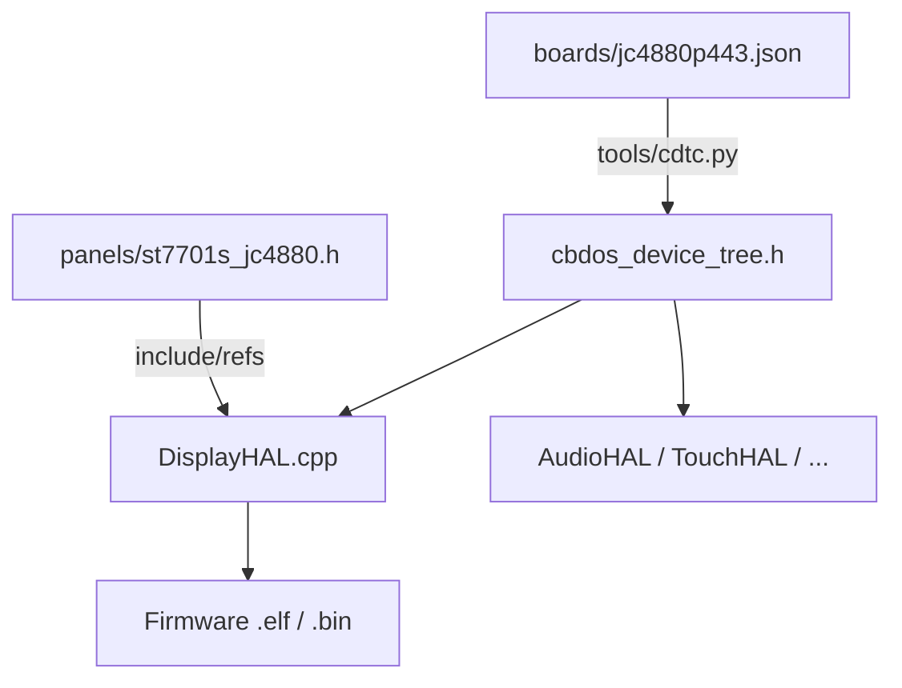

# Especificación Canónica: Compiled Device Tree (CDTc) y Universal Resource Manager (URM)

> **DOCUMENTO CANÓNICO — FUENTE DE LA VERDAD DE HARDWARE (CBDos)**  
> **Rol:** define *qué* es el CDT, la estructura de carpetas y los nombres de las constantes.  
> **Jerarquía:** el *porqué* está en [`CDT_POR_QUE_Y_OBJETIVO.md`](CDT_POR_QUE_Y_OBJETIVO.md); los *pasos* en [`PLAN_MIGRACION_CDT_Y_DRIVERS.md`](PLAN_MIGRACION_CDT_Y_DRIVERS.md). Si hay contradicción, manda el documento del porqué sobre el alcance, y este sobre nombres/mapa.  
> Todo spec de hardware anterior queda revocado y archivado en `specs/history/`.

---

## 1. Estructura de Carpetas (Cómo se Organizan los Datos)

Esta es la estructura objetivo del sistema. **No existe otra ubicación válida para estos datos.**

```
boards/                          ← DATOS DE LA PLACA (el PCB concreto)
  jc4880p443.json                una placa = un JSON
  jc3248w535.json                futura: otra placa = otro JSON
  ...                            (N placas = N JSONs)

panels/                          ← DATOS DE LA PANTALLA (el módulo de display)
  st7701s_jc4880.h               una pantalla = un .h (init sequence + timings)
  axs15231b.h                    futura: otra pantalla = otro .h
  ...                            (N pantallas = N .h)

tools/cdtc.py                    JSON → cbdos_device_tree.h (constexpr)

bsp/<placa>/hal/
  DisplayHAL.cpp                 driver genérico: LEE del DT, no hardcodea
  AudioHAL.cpp                   idem
  TouchHAL.cpp                   idem
```

### 1.1 ¿Qué va en `boards/*.json`? (la placa)

Todo lo que depende del **PCB**, no del componente genérico:

| Sección del JSON | Contenido | Ejemplo (JC4880) |
|---|---|---|
| `display` | pines RST/BL, LDO, referencia al panel, expansion | rst=5, bl=23, ldo mipi 2500mV |
| `audio_i2s` | pines I2S, puerto I2S, dir I2C códec | mclk=13, i2s_port=0, addr=0x30 |
| `touch_i2c0` | pines I2C/touch, puerto I2C | sda=7, scl=8, **rst=22, int=21** |
| `sdmmc` | pines SD | d0..d3, clk, cmd |
| `console_uart0` | pines consola | tx=38, rx=37 |
| `power_control` | pin enable | en=36 |
| `coprocessor_c6` | SDIO, reset, handshake | sdio=[14..19] |
| `battery_sensor` | pin ADC batería | bat_adc=53 |
| `system_buttons` | pin botón BOOT | boot=35 |
| `nc_pins` | pines no ruteados | [1, 2] |
| `expansion.jp1_allowed` | pines libres expansión | [28..34, 49..52] |

**Criterio:** si cambias de placa Guition a Lilygo y ese dato cambia → va en el JSON de la placa.

### 1.2 ¿Qué va en `panels/*.h`? (la pantalla)

Solo lo que depende del **módulo de display concreto**:

| Contenido | Por qué archivo aparte |
|---|---|
| Init sequence DCS (~100 comandos de bytes) | Demasiado pesada para JSON; es data binaria opaca |
| Timings DSI/DPI (hsync, vsync, clock MHz, lanes) | Especificaciones del panel, no del PCB |

**Criterio:** si dos placas usan el **mismo panel**, comparten el mismo `.h` y solo tienen JSONs distintos.

### 1.3 ¿Por qué SOLO la pantalla tiene directorio propio?

| Componente | Config que varía | Dónde vive | ¿Archivo aparte? |
|---|---|---|---|
| **Pantalla** | Init sequence + timings (pesado) | `panels/*.h` | ✅ Sí |
| Audio | 6 pines + puerto + dirección I2C | `boards/*.json` | ❌ Cabe en JSON |
| Touch | 4 pines + puerto I2C | `boards/*.json` | ❌ Cabe en JSON |
| SD | 6 pines | `boards/*.json` | ❌ Cabe en JSON |
| UART, power, C6, etc. | pines sueltos | `boards/*.json` | ❌ Cabe en JSON |

**No hay `audio/`, `touch/`, `sd/` como carpetas propias** — todo eso es configuración ligera de placa.

### 1.4 Flujo de Compilación



1. `cdtc.py` lee el JSON → genera header con namespaces `cbdos::board::*`
2. `DisplayHAL.cpp` incluye el header DT (pines, LDO, timings si están) y el `.h` del panel referenciado (init sequence)
3. Los demás HALs incluyen solo el header DT

### 1.5 Salida del Generador

**Única salida implementada hoy:** `cbdos_device_tree.h` (constexpr en C++).

**Salida binaria `board.cdt` (futuro, condicionada):**
- Solo se implementará si hay **partición en flash + loader en arranque** que la consuma.
- Sin eso, el binario es un archivo huérfano: **no forma parte del alcance actual**.
- Si se hace, formato `struct.RawDeviceTree` en [`CDT_TECHNICAL_SPEC.md`](CDT_TECHNICAL_SPEC.md).

---

## 2. Mapa Canónico de Hardware: Guition JC4880P443C (ESP32-P4)

> Fuente: `boards/jc4880p443.json` (única fuente de verdad de pines).

### 2.1 Periféricos del Sistema (`SYSTEM_PINS`)

| Periférico | Función / Señal | GPIO ESP32-P4 | Constante C++ |
| :--- | :--- | :--- | :--- |
| **Pantalla LCD (ST7701S)** | Reset (RST) | **GPIO 5** | `cbdos::board::display::PIN_RST` |
| | Backlight PWM (BL) | **GPIO 23** | `cbdos::board::display::PIN_BL` |
| **Touchscreen (Goodix GT911)** | I2C SDA | **GPIO 7** | `cbdos::board::touch::PIN_SDA` |
| | I2C SCL | **GPIO 8** | `cbdos::board::touch::PIN_SCL` |
| | Touch Reset (RST) | **GPIO 22** ✅ | `cbdos::board::touch::PIN_RST` |
| | Touch INT | **GPIO 21** ✅ | `cbdos::board::touch::PIN_INT` |
| **Audio (ES8311 + NS4150)** | I2S MCLK | **GPIO 13** | `cbdos::board::audio::PIN_MCLK` |
| | I2S BCLK | **GPIO 12** | `cbdos::board::audio::PIN_BCLK` |
| | I2S WS / LRCK | **GPIO 10** | `cbdos::board::audio::PIN_WS` |
| | I2S DOUT (Speaker) | **GPIO 9** | `cbdos::board::audio::PIN_DOUT` |
| | I2S DIN (Mic) | **GPIO 48** | `cbdos::board::audio::PIN_DIN` |
| | PA Enable | **GPIO 11** | `cbdos::board::audio::PIN_PA` |
| **MicroSD (SDMMC 4-bit)** | D0..D3 | **GPIO 39, 40, 41, 42** | `cbdos::board::sdcard::PIN_D0..D3` |
| | CLK, CMD | **GPIO 43, 44** | `cbdos::board::sdcard::PIN_CLK, PIN_CMD` |
| **Consola UART0** | TX, RX | **GPIO 38, 37** | `cbdos::board::console::PIN_TX, PIN_RX` |
| **Alimentación (Hardware)** | Carril 3.3V Fijo (TLV62569) | **N/A (EN soldado a VIN)** | Permanente por hardware (no conmutable). GPIO 36 es strapping ROM con pull-up pasivo. |
| **Coprocesador ESP32-C6** | SDIO D0..D3, CLK, CMD | **GPIO 14, 15, 16, 17, 18, 19** | `cbdos::board::coprocessor::PINS_SDIO` |
| | C6 Reset | **GPIO 54** | `cbdos::board::coprocessor::PIN_RESET` |
| | C6 Handshake | **GPIO 6** | `cbdos::board::coprocessor::PIN_HANDSHAKE` |
| **Sensor de Batería** | BAT_ADC | **GPIO 53** | `cbdos::board::sensors::PIN_BATTERY_ADC` |
| **Botón BOOT** | BOOTMODE | **GPIO 35** | `cbdos::board::buttons::PIN_BOOT` |

✅ **Datos verificados (2026-09-23 / 2026-09-24) contra esquemático `JC4880P443_V1.0`:**
- **Touch RST/INT = 22/21** (`3_ESP32-P4.png` nets TOUCH_*; `2_LCD&CSI.png` FPC 23/26). El JSON/TouchHAL **viejos** decían 3,4 — incorrecto (3,4 = NC). Corregir en **Paso 1** del plan.
- **Códec ES8311:** 0x18 = addr 7-bit (docs) · 0x30 = 0x18<<1 write-addr (IDF I2C). Mismo dispositivo, no hay conflicto.
- **Alimentación 3.3V:** El regulador TLV62569 tiene su pin EN soldado a VIN (`1_PWR.png`). GPIO 36 es pin de strapping de arranque de la ROM con pull-up R44 (10k) a 3.3V; no conmuta potencia (`plan_arquitectura_power_flasher_device_tree.md`).

### 2.2 Pines de Expansión (`EXPANSION_PINS` / Cabecera JP1)

* **GPIO 28, 29, 30, 31, 32, 33, 34, 49, 50, 51, 52** (`NUM_EXPANSION_PINS = 12`)

### 2.3 Pines No Ruteados (NC)

* **GPIO 1, GPIO 2, GPIO 3, GPIO 4** → `nc_pins` en JSON → `PinState::NotConnected` en URM  
  (GPIO 3,4 confirmados NC en esquemático; **no** son Touch RST/INT)

---

## 3. Universal Resource Manager (URM)

**Estado actual:** esqueleto en `core/src/system/urm.cpp` **sin consumidores** — API vieja (`claimGpio`/`SystemLocked`) pendiente de purga (Paso 12 del plan).

**Estado objetivo:**

1. **Recursos del Sistema:** al hacer `init()`, los `SYSTEM_PINS` nacen `InUse` con owner (`"display"`, `"touch"`, ...).
2. **Recursos de Expansión:** los `EXPANSION_PINS` nacen `Available`; solo `claimPin` dentro de ese grupo.
3. **NC:** `nc_pins` nacen `NotConnected`.
4. **Wiring:** `isPinAvailable()` de los backends delega al URM; `init()` se llama en `app_main` antes de los HALs.

*Contrato de API:* [`CDT_TECHNICAL_SPEC.md`](CDT_TECHNICAL_SPEC.md) §2.

---

## 4. Fases de Ejecución

El plan detallado (pasos atómicos, archivos, criterios de build) vive en  
[`PLAN_MIGRACION_CDT_Y_DRIVERS.md`](PLAN_MIGRACION_CDT_Y_DRIVERS.md).

Resumen:

| Fase | Objetivo |
|---|---|
| **A** | Nivel 1: todos los pines en DT; migrar Touch, Display.h, Audio, UART, Storage, Flasher |
| **B** | Nivel 2 multi-placa: LDO/DSI/timings en JSON; init sequence a `panels/`; drivers genéricos |
| **C** | URM real + NC + `board.cdt` (solo con loader) + S3 en el sistema + purga de docs |

**Éxito de la Fase B:** nueva placa P4 = 1 JSON + 1 `panels/*.h` + build. Cero ediciones en `DisplayHAL.cpp`, `AudioHAL.cpp`, `TouchHAL.cpp`.
