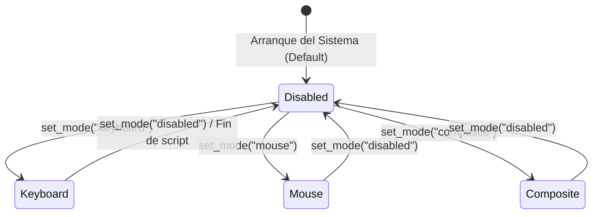

# Control Dinámico de Modos USB HID y API para Scripts Lua (CBDos v0.2.1)

## 📌 1. Visión General y Principio de Operación

En CyBerDeck OS (CBDos), el subsistema USB opera bajo un modelo de **Control de Modo Dinámico (On-Demand / Zero-Interference)**.

### Objetivos Principales:
1. **Seguridad y Estabilidad del Flasher/Consola:** Al arrancar el sistema operativo, el hardware USB opera por defecto en modo **`Disabled`** (puerto Serial CDC estándar de desarrollo). Esto garantiza que la PC anfitriona detecte siempre el microcontrolador sin riesgo de inyecciones accidentales de teclas y permitiendo el reseteo/flasheo por software en cualquier momento.
2. **Activación Bajo Demanda:** Las aplicaciones nativas C++ y los scripts interactivos de **Lua** pueden cambiar el estado del controlador USB en caliente para actuar como teclado, ratón o dispositivo compuesto.
3. **Multi-Target Universal:** La misma API y los mismos scripts Lua funcionan de forma idéntica en **ESP32-P4** (vía USB OTG nativo) y en **ESP32-S3** (vía TinyUSB compuesto).

---

## 🎛️ 2. Estados y Modos del Controlador HID



### Tabla de Modos (`HidMode`):
| Modo | Descripción | Estado de la Consola Serie | Comportamiento en Host |
| :--- | :--- | :--- | :--- |
| **`Disabled`** *(Default)* | Emulación HID apagada | Activa (`/dev/ttyACM0`) | Solo puerto serie. Flasheo y depuración 100% seguros. |
| **`Keyboard`** | Teclado virtual activo | Activa | Permite enviar teclas y comandos DuckyScript. |
| **`Mouse`** | Ratón virtual activo | Activa | Permite mover cursor y clics de botones. |
| **`Composite`** | Teclado + Ratón activos | Activa | Permite control total de puntero y pulsaciones. |

---

## 💻 3. Contrato de la API en C++ (`core/include/cbdos/hid.hpp`)

```cpp
namespace cbdos {
namespace hid {

enum class HidMode {
    Disabled,   ///< Solo Serial CDC (Seguro, sin inyección)
    Keyboard,   ///< Teclado USB activo
    Mouse,      ///< Ratón USB activo
    Composite   ///< Teclado + Ratón USB activos
};

/// Activa o desactiva dinámicamente el modo HID
bool setMode(HidMode mode);

/// Consulta el modo HID actual
HidMode getMode();

/// Retorna true si el modo actual permite enviar reportes de teclado/ratón
bool isEnabled();

} // namespace hid
} // namespace cbdos
```

---

## 📜 4. Integración y API para Scripts de Lua (`LuaBridge`)

Los scripts de Lua en CBDos tienen acceso al módulo global `cbdos.hid`:

### Funciones Disponibles en Lua:
- `cbdos.hid.set_mode(mode_str)`: Cambia el modo dinámicamente. Valores aceptados: `"disabled"`, `"keyboard"`, `"mouse"`, `"composite"`.
- `cbdos.hid.get_mode()`: Retorna el string del modo actual.
- `cbdos.hid.press_keys({modifiers, key})`: Presiona una combinación de teclas.
- `cbdos.hid.write(text)`: Escribe una cadena de texto respetando retardos.
- `cbdos.hid.mouse_move(dx, dy, wheel)`: Mueve el cursor del ratón.
- `cbdos.hid.mouse_click(button)`: Realiza un clic (`"left"`, `"right"`, `"middle"`).

### Ejemplo de Script Lua Completo (BadUSB / Automatización):

```lua
-- apps/payloads/open_calculator.lua
print("--- Iniciando Payload Lua HID ---")

-- 1. Activar el teclado
if not cbdos.hid.set_mode("keyboard") then
    print("Error: No se pudo activar el modo HID")
    return
end

cbdos.system.sleep(500) -- Tiempo para que el host configure los descriptores

-- 2. Enviar combinación de teclas para abrir Ejecutar (Win + R)
cbdos.hid.press_keys({"GUI", "r"})
cbdos.system.sleep(300)

-- 3. Escribir comando
cbdos.hid.write("notepad.exe\n")
cbdos.system.sleep(1000)

-- 4. Escribir mensaje dentro del bloc de notas
cbdos.hid.write("Hola desde CyBerDeck OS (CBDos v0.2.1)!\n")
cbdos.system.sleep(300)

-- 5. Desactivar el modo HID y restaurar el puerto serie normal
cbdos.hid.set_mode("disabled")
print("--- Payload completado y modo HID apagado ---")
```
