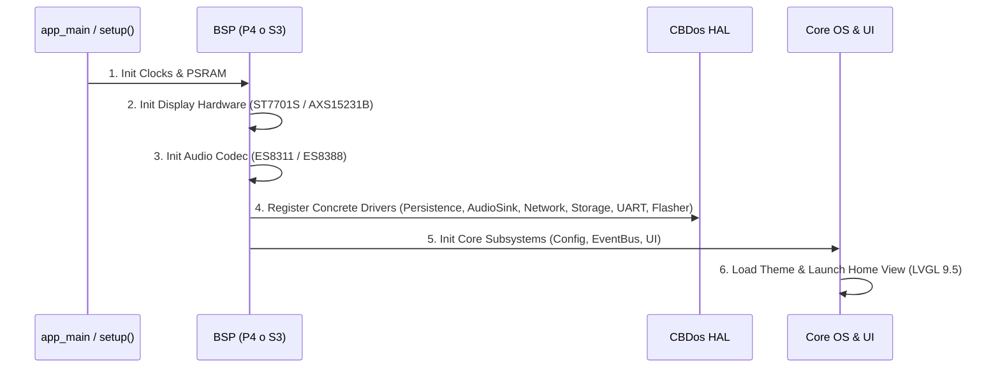

# 🏛️ Especificación Maestra de Arquitectura de CBDos (Core / HAL / BSP)

## 📌 1. Filosofía y Principios de Diseño

**CBDos** es un sistema operativo embebido multi-target diseñado bajo el principio de **desacoplamiento total del hardware**. El 90% del software (interfaz gráfica LVGL 9.5, lógica de aplicaciones, motor de scripting Lua, decodificadores de audio Helix y servicios del sistema) reside en un núcleo (`core/`) que es **100% agnóstico a la plataforma**.

```
┌─────────────────────────────────────────────────────────────────────────┐
│                      CAPA DE APLICACIÓN (LVGL 9.5)                      │
│   RadioView   •   FileManagerView   •   MusicPlayer   •   SettingsView  │
└────────────────────────────────────┬────────────────────────────────────┘
                                     │ (Consume Servicios y Eventos)
┌────────────────────────────────────▼────────────────────────────────────┐
│                           CORE SERVICES & LOGIC                         │
│  • ConfigManager (usa IPersistence)    • AudioPipeline (usa IAudioSink) │
│  • EventBus (Pub/Sub desacoplado)      • FileOperationsService          │
│  • Decodificadores (Helix MP3/AAC/WAV) • LuaEngine                      │
└────────────────────────────────────┬────────────────────────────────────┘
                                     │ (Interfaces Abstractas C++ HAL)
                                     ▼
                      ┌───────────────────────────────┐
                      │    CBDOS HAL (Contratos)      │
                      │  • IPersistenceBackend        │
                      │  • IAudioSink                 │
                      │  • INetworkAdapter            │
                      │  • IDisplayDriver             │
                      └──────────────┬────────────────┘
                                     │
             ┌───────────────────────┴───────────────────────┐
             ▼                                               ▼
┌─────────────────────────────┐               ┌─────────────────────────────┐
│    BSP ESP32-P4 (ESP-IDF)   │               │   BSP ESP32-S3 (PlatformIO) │
│ • nvs_flash Driver          │               │ • Preferences Driver        │
│ • ES8311 I2S Sink           │               │ • Arduino I2S Audio Sink    │
│ • C6 SDIO Hosted Network    │               │ • Native WiFi Adapter       │
│ • MIPI-DPI ST7701S Driver   │               │ • QSPI AXS15231B Driver     │
└─────────────────────────────┘               └─────────────────────────────┘
```

---

## 🚫 2. Ley de Pureza Arquitectónica de `core/` (Zero Platform Pollution)

1. **Agnosticismo Estricto de `core/`:**
   * `core/` DEBE ser código C++ estándar (C++17/20) y LVGL 9.5 puro.
   * **PROHIBIDO** incluir headers de plataformas (`<Arduino.h>`, `<Preferences.h>`, `<SD.h>`, `<driver/...>`, `<esp_...>` directos de hardware).
   * **PROHIBIDO** bifurcar la lógica de negocio mediante `#ifdef ARDUINO` o `#ifdef ESP_PLATFORM` dentro de `core/`.

2. **Inyección de Dependencias en el Arranque:**
   * Las interfaces son declaradas en `core/include/cbdos/`.
   * Los Board Support Packages (`bsp/`) implementan los contratos y los registran en el arranque del sistema (`app_main` o `setup()`).

3. **Filosofía Offline-First:**
   * La UI, audio, almacenamiento y emuladores deben inicializarse y funcionar sin requerir conexión a internet ni la presencia obligatoria de coprocesadores de red.

4. **Principio de Arquitectura Reactiva (Cero Polling Innecesario):**
   * El sistema opera bajo un modelo *Event-Driven*: el hardware o los controladores del BSP disparan interrupciones o callbacks nativos ante eventos físicos (conexión/desconexión USB, eventos de red, recepción de paquetes, inserción de tarjetas o estado de energía).
   * La interfaz gráfica (`core/`) y los servicios consumen estos eventos y activan banderas reactivas (`m_statusDirty = true`) para procesar o redibujar únicamente en el cuadro correspondiente cuando ocurre una transición real, manteniendo el procesador en reposo y prohibiendo terminantemente el sondeo periódico (*polling*) en bucles como atajo de diseño.

---

## 📐 3. Contratos de la Capa de Abstracción de Hardware (HAL)

### 3.1. Persistencia y NVS (`IPersistenceBackend`)
Desacopla el almacenamiento clave-valor para evitar dependencias cruzadas entre `Preferences.h` de Arduino y `nvs_flash.h` de ESP-IDF.

```cpp
// core/include/cbdos/persistence.hpp
#pragma once
#include <string>
#include <cstdint>

namespace cbdos {
namespace persistence {

class IPersistenceBackend {
public:
    virtual ~IPersistenceBackend() = default;

    virtual bool begin(const char* nameSpace, bool readOnly = false) = 0;
    virtual void end() = 0;
    virtual bool clear() = 0;

    virtual bool setUChar(const char* key, uint8_t value) = 0;
    virtual uint8_t getUChar(const char* key, uint8_t defaultValue = 0) = 0;

    virtual bool setInt(const char* key, int32_t value) = 0;
    virtual int32_t getInt(const char* key, int32_t defaultValue = 0) = 0;

    virtual bool setUInt(const char* key, uint32_t value) = 0;
    virtual uint32_t getUInt(const char* key, uint32_t defaultValue = 0) = 0;

    virtual bool setBool(const char* key, bool value) = 0;
    virtual bool getBool(const char* key, bool defaultValue = false) = 0;

    virtual bool setString(const char* key, const std::string& value) = 0;
    virtual std::string getString(const char* key, const std::string& defaultValue = "") = 0;
};

void setBackend(IPersistenceBackend* backend);
IPersistenceBackend* getBackend();

} // namespace persistence
} // namespace cbdos
```

---

### 3.2. Pipeline de Audio (`IAudioSink` y `IAudioDecoder`)
Separa el hardware de salida (I2S/DAC) de los algoritmos de decodificación de audio comprimido.

```cpp
// core/include/cbdos/audio_sink.hpp
#pragma once
#include <cstdint>
#include <cstddef>

namespace cbdos {
namespace audio {

class IAudioSink {
public:
    virtual ~IAudioSink() = default;

    virtual bool init(uint32_t sampleRate, uint8_t channels, uint8_t bitsPerSample) = 0;
    virtual size_t write(const int16_t* pcmSamples, size_t sampleCount) = 0;
    virtual void setVolume(uint8_t volumePercent) = 0;
    virtual void mute(bool enable) = 0;
    virtual void deinit() = 0;
};

} // namespace audio
} // namespace cbdos
```

```cpp
// core/src/audio/decoders/IAudioDecoder.hpp
#pragma once
#include <cstdint>
#include <cstddef>

namespace cbdos {
namespace audio {

enum class CodecType { MP3, AAC, WAV, Unknown };

class IAudioDecoder {
public:
    virtual ~IAudioDecoder() = default;

    virtual bool open(const char* path) = 0;
    virtual bool decodeFrame(int16_t* outPcm, size_t maxSamples, size_t& samplesDecoded) = 0;
    virtual bool seekMs(uint32_t ms) = 0;
    virtual uint32_t getDurationMs() const = 0;
    virtual uint32_t getPositionMs() const = 0;
    virtual void close() = 0;
};

} // namespace audio
} // namespace cbdos
```

---

### 3.3. Adaptador de Red (`INetworkAdapter`) y Backend de Radio (`IRadioBackend`)
Estandariza la conectividad ya sea nativa (ESP32-S3) o a través de coprocesador SDIO (ESP32-P4 + C6). *Para el análisis exhaustivo, consultar [arquitectura_abstraccion_radio_y_red_hal.md](file:///home/kaber420/Documentos/proyectos/cbdos/docs/network/arquitectura_abstraccion_radio_y_red_hal.md).*

```cpp
// core/include/cbdos/network.hpp
#pragma once
#include <cstdint>
#include <string>

namespace cbdos {
namespace network {

enum class NetStatus {
    Disconnected,
    Connecting,
    Connected,
    Error
};

class INetworkAdapter {
public:
    virtual ~INetworkAdapter() = default;

    virtual bool init() = 0;
    virtual bool connectWifi(const char* ssid, const char* password) = 0;
    virtual bool connectWifiStatic(const char* ssid, const char* password, const char* ip, const char* gateway, const char* subnet = "255.255.255.0", const char* dns = nullptr) = 0;
    virtual void disconnectWifi() = 0;
    virtual NetStatus getStatus() const = 0;
    virtual bool isConnected() const = 0;
    virtual std::string getIpAddress() const = 0;
    virtual int8_t getRssi() const = 0;
};

void setNetworkAdapter(INetworkAdapter* adapter);
INetworkAdapter* getNetworkAdapter();

} // namespace network
} // namespace cbdos
```

---

### 3.4. Bus de Eventos Reactivo (`EventBus`)
Elimina la necesidad de variables globales estáticas en las vistas de UI y el acoplamiento directo con tareas de FreeRTOS.

```cpp
// core/include/cbdos/event_bus.hpp
#pragma once
#include <cstdint>
#include <functional>
#include <unordered_map>
#include <vector>

namespace cbdos {

enum class EventId : uint16_t {
    // Sistema
    LowMemory,
    BatteryChanged,
    BrightnessChanged,
    VolumeChanged,

    // Conectividad
    WifiConnected,
    WifiDisconnected,
    WifiScanCompleted,

    // Almacenamiento
    SdCardMounted,
    SdCardUnmounted,

    // Audio
    AudioTrackChanged,
    AudioTrackFinished,
    RadioBuffering,
    RadioPlaying
};

struct EventData {
    EventId id;
    int32_t param1 = 0;
    int32_t param2 = 0;
    void* ptr = nullptr;
};

using EventCallback = std::function<void(const EventData&)>;

class EventBus {
public:
    static EventBus& getInstance();

    uint32_t subscribe(EventId id, EventCallback callback);
    void unsubscribe(uint32_t subscriptionId);
    void post(const EventData& event);
    void processQueue(); // Llamado desde el loop principal de UI
};

} // namespace cbdos
```

---

### 3.5. Ciclo de Vida de Aplicaciones Nativas (`INativeApp`)
Estandariza la ejecución de emuladores y launchers sin hackear la memoria de LVGL.

```cpp
// core/include/cbdos/native_app.hpp
#pragma once

namespace cbdos {

class INativeApp {
public:
    virtual ~INativeApp() = default;

    virtual bool onPrepare() = 0; // Verifica requerimientos de RAM / ROM
    virtual void onSuspendOS() = 0; // Pausa el render de LVGL y cede recursos
    virtual void onRun() = 0;       // Loop principal exclusivo
    virtual void onResumeOS() = 0;  // Restaura la UI de LVGL y el estado del sistema
};

} // namespace cbdos
```

---

### 3.6. Flasheo Serial Universal (`cbdos::flasher`)
Permite flashear microcontroladores externos (ESP32/ESP8266/C6) desde MicroSD o binarios embebidos.

```cpp
// core/include/cbdos/flasher.hpp
#pragma once
#include <string>
#include <vector>
#include <functional>

namespace cbdos {
namespace flasher {

struct FlasherConfig {
    int txPin = 32;
    int rxPin = 28;
    int bootPin = 34;
    int rstPin = 54;
    uint32_t baudRate = 115200;
    uint32_t flashOffset = 0x0;
    std::string binPath = "";
    std::string presetName = "";
};

bool isSupported();
bool isBusy();
const std::vector<FlasherPreset>& getPresets();
FlasherConfig getDefaultConfig();
bool startFlash(const FlasherConfig& config, FlasherProgressCb progressCb = nullptr);

} // namespace flasher
} // namespace cbdos
```

---

### 3.7. Terminal Serial UART (`cbdos::uart`)
Permite lectura y escritura interactiva por hardware serie, terminal de comandos y data logging.

```cpp
// core/include/cbdos/uart.hpp
#pragma once
#include <cstdint>
#include <cstddef>
#include <string>
#include <vector>

namespace cbdos {
namespace uart {

struct UartPinPreset {
    std::string name;
    int txPin;
    int rxPin;
};

bool init(int txPin, int rxPin, uint32_t baudrate);
void deinit();
bool isInitialized();
size_t available();
size_t read(uint8_t* buffer, size_t maxLen);
std::string readString(size_t maxLen = 1024);
size_t write(const uint8_t* data, size_t len);
size_t writeString(const std::string& str);
void flush();
bool setBaudrate(uint32_t baudrate);

int getDefaultTxPin();
int getDefaultRxPin();
uint32_t getDefaultBaudrate();
const std::vector<UartPinPreset>& getPinPresets();

} // namespace uart
} // namespace cbdos
```

---

### 3.8. Text-to-Speech (TTS) Offline (`cbdos::tts::ITextToSpeechService`)
Subsistema agnóstico de síntesis de voz natural y texto a voz 100% offline basado en **SVOX Pico TTS**. El servicio se desacopla a través de una interfaz abstracta y delega la emisión física de audio a la interfaz HAL `IAudioSink`.

```cpp
// core/include/cbdos/tts.hpp
#pragma once
#include <string>

namespace cbdos {
namespace tts {

enum class TTSState {
    Uninitialized,
    Idle,
    Speaking,
    Paused,
    Error
};

class ITextToSpeechService {
public:
    virtual ~ITextToSpeechService() = default;
    virtual bool init() = 0;
    virtual bool speak(const std::string& text) = 0;
    virtual void stop() = 0;
    virtual void pause() = 0;
    virtual void resume() = 0;
    virtual bool isSpeaking() const = 0;
    virtual TTSState getState() const = 0;
    virtual void setSpeed(int speedPercent) = 0;
    virtual void setPitch(int pitchPercent) = 0;
};

ITextToSpeechService* getTextToSpeechService();
void setTextToSpeechService(ITextToSpeechService* service);

} // namespace tts
} // namespace cbdos
```

#### Principios Arquitectónicos de TTS:
1. **Aislamiento en Core 0:** La síntesis corre en una tarea FreeRTOS fijada en el Core 0 con prioridad baja/media (2), garantizando que el Core 1 mantenga la tasa de 60 FPS de LVGL 9.5 sin caídas de cuadros ni contención.
2. **Síntesis Completa en PSRAM (Zero DMA Underflow):** Las muestras PCM de 16 kHz Mono se acumulan primero en memoria (`std::vector<int16_t>`), sintetizando una frase típica de 2 segundos en ~300 ms de CPU a 400 MHz.
3. **Remuestreo Global Continuo a 44.1 kHz Estéreo:** Una sola pasada matemática lineal sobre el búfer completo elimina saltos de fase en los límites de bloques, evitando ruidos espurios y zumbidos.
4. **Streaming DMA por Bloques Grandes:** El audio se transfiere al códec (ES8311 en P4, ES8388 / DAC en S3) en bloques estándar de 1024 frames (4096 bytes), llenando el pipeline DMA de I2S sin retardos.
5. **Ciclo de Vida Limpio (Bajo Demanda):** El motor carga los diccionarios desde `/sdcard/tts/es/` solo al hablar y permite invocar `shutdown()` para liberar los ~1.95 MB de PSRAM al terminar.

---

## 🔄 4. Flujo de Inicialización Multi-Target (Boot Flow)



---

## 📁 5. Tabla Maestra de Módulos HAL y Nomenclatura Homogénea

| Subsistema / Módulo | Interfaz Core (`core/include/cbdos/`) | Implementación P4 (`bsp/esp32_p4_jc4880/hal/`) | Implementación S3 (`bsp/esp32_s3_jc3248/hal/`) |
| :--- | :--- | :--- | :--- |
| **Text-to-Speech (TTS)** | `tts.hpp` | `core/src/tts/PicoTTSService.cpp` (PicoTTS / IAudioSink) | `core/src/tts/PicoTTSService.cpp` (PicoTTS / IAudioSink) |
| **Radio & Malla** | `radio.hpp`, `mesh/mesh_engine.hpp` | `hal_radio_p4.cpp` | `hal_radio_s3.cpp` |
| **Flasheador Serial** | `flasher.hpp` | `hal_flasher_p4.cpp` | `hal_flasher_s3.cpp` |
| **Terminal UART** | `uart.hpp` | `hal_uart_p4.cpp` | `hal_uart_s3.cpp` |
| **Almacenamiento** | `storage.hpp` | `hal_storage_p4.cpp` | `hal_storage_s3.cpp` |
| **Audio (I2S / Códec)** | `audio.hpp` | `hal_audio_p4.cpp` | `hal_audio_s3.cpp` |
| **Red (WiFi / Host)** | `network.hpp` | `hal_network_p4.cpp` | `hal_network_s3.cpp` |
| **Pantalla (Display)** | `display.hpp` | `hal_display_p4.cpp` | `hal_display_s3.cpp` |
| **Entrada Táctil & Multi-Touch** | `input.hpp` | `hal_input_p4.cpp` (GT911 5-dedos) | `hal_input_s3.cpp` (Monotáctil) |
| **Emulación USB HID & MacroPad** | `hid.hpp` | `hal_hid_p4.cpp` (TinyUSB High-Speed) | `hal_hid_s3.cpp` (USB HID / BLE) |
| **Terminal Modular** | `terminal_stream.hpp` | `SerialStreamAdapter.cpp`, `SshStreamAdapter.cpp` | `SerialStreamAdapter.cpp`, `SshStreamAdapter.cpp` |
| **Cliente SSH** | `ssh.hpp` | `hal_ssh_p4.cpp` (libssh) | `hal_ssh_s3.cpp` (libssh) |
| **Persistencia (NVS)** | `persistence.hpp`, `config_manager.hpp` | `hal_persistence_p4.cpp` | `hal_persistence_s3.cpp` |
| **Sistema & Ticks** | `system.hpp` | `hal_system_p4.cpp` | `hal_system_s3.cpp` |
