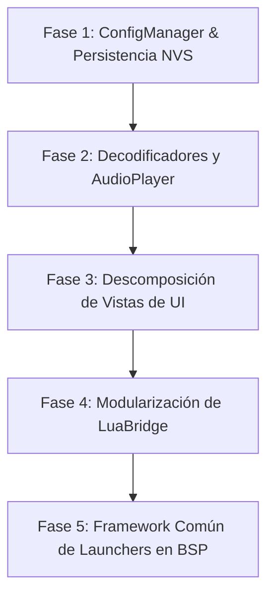

# 📐 Documento Técnico: Análisis de Modularización y Refactorización Arquitectónica (CBDos v0.2.1)

## 📌 1. Introducción y Justificación

A medida que el sistema operativo **CBDos** ha integrado nuevas aplicaciones, capacidades multimedia (decodificación Helix MP3/AAC, streaming Icecast), soporte para cartuchos y entornos de ejecución (Lua, GameBoy Color, Doom), varios componentes clave del código fuente en `core/` y `bsp/` han evolucionado hacia **monolitos ("God Objects")** o han mezclado responsabilidades entre capas (UI + I/O de archivos + Red + Sockets).

Este documento presenta una radiografía exhaustiva de los módulos de gran tamaño, su diagnóstico de acoplamiento y la estrategia técnica de descomposición y modularización para asegurar la mantenibilidad y la compatibilidad estricta con la arquitectura multi-target (**ESP32-P4** con ESP-IDF y **ESP32-S3** con Arduino).

---

## 📊 2. Inventario de Archivos Monolíticos y Métricas

A continuación se detallan los componentes propietarios más extensos del proyecto (excluyendo bibliotecas externas de terceros en `.pio/`, `libhelix`, `managed_components` o emuladores base):

| Componente / Archivo | Ubicación | Líneas (LOC) | Capas Mezcladas | Nivel de Riesgo |
| :--- | :--- | :--- | :--- | :---: |
| **ConfigManager** | `core/src/network/ConfigManager.cpp` | ~1,045 | NVS + Persistencia + UI Themes + Audio/Brillo + mbedTLS Cifrado + Gateways | 🔴 Crítico |
| **AudioPlayer** | `core/src/audio/AudioPlayer.cpp` | ~775 | Decodificación MP3 + AAC + WAV + Sockets HTTP + ICY Metadata | 🔴 Crítico |
| **RadioView** | `core/src/ui/views/RadioView.cpp` | ~791 | UI LVGL + 4 Tabs completas + Búsqueda FreeRTOS Asíncrona + Control Audio | 🟡 Medio-Alto |
| **TextEditorView** | `core/src/ui/views/TextEditorView.cpp` | ~706 | Interfaz LVGL + Teclado Virtual + Buffer I/O Archivos + Modales | 🟡 Medio |
| **LuaBridge** | `core/src/lua/LuaBridge.cpp` | ~661 | Bindings de Pantalla + Sonido + GPIO + Sistema + Utilidades matemáticas | 🟡 Medio |
| **GBCLauncher** | `bsp/esp32_s3_jc3248/src/GBCLauncher.cpp` | ~656 | Suspensión LVGL + Buffers I2S + DMA Framebuffers + Loop de emulador | 🟢 Medio-Bajo |
| **FileManagerView** | `core/src/ui/views/FileManagerView.cpp` | ~655 | Explorador UI + Operaciones FS (copiar, mover, borrar) + Modales | 🟡 Medio |
| **LuaRunnerView** | `core/src/ui/views/LuaRunnerView.cpp` | ~640 | Explorador de Scripts + Consola de logs + UI de ejecución | 🟡 Medio |
| **LuaLauncher** | `bsp/esp32_s3_jc3248/src/LuaLauncher.cpp` | ~612 | Ciclo de vida de App + Configuración de Pantalla/Audio + Event Loop | 🟢 Medio-Bajo |
| **RadioManager** | `core/src/audio/RadioManager.cpp` | ~501 | Sockets de Streaming + Circular Buffer + Parser ICY + Favoritos | 🟡 Medio |

---

## 🔍 3. Diagnóstico Detallado y Propuestas de Desacoplamiento

---

### 1. `ConfigManager` (God Object & Falsa Ubicación)
* **Ubicación actual:** `core/src/network/ConfigManager.cpp`
* **Diagnóstico de Acoplamiento:**
  1. **Ubicación errónea:** El archivo reside en la carpeta `network/`, pero administra variables globales de pantalla (brillo, timeout), audio (volumen), personalización (temas oscuro/claro), estado de LoRa/FLRC y gateways de telemetría.
  2. **Acoplamiento a Framework Arduino:** Hace uso directo de `<Preferences.h>` y `#ifdef ARDUINO`, rompiendo la independencia del núcleo `core/` para targets que utilicen ESP-IDF nativo (`nvs_flash`).
  3. **Mezcla con Servicios de Seguridad:** Incluye lógica de serialización JSON y cifrado/descifrado de copias de seguridad mediante `mbedtls/gcm.h` y `mbedtls/pkcs5.h`.

```
┌────────────────────────────────────────────────────────┐
│               ConfigManager (Monolito)                 │
├───────────────┬────────────────┬───────────────────────┤
│ Sistema & UI  │ Conectividad   │ Persistencia & Cripto │
│ (Brillo, Vol, │ (WiFi, LoRa,   │ (NVS Preferences,     │
│  Temas)       │  Gateways)     │  mbedTLS GCM, Backup) │
└───────────────┴────────────────┴───────────────────────┘
```

* **Estructura Modular Propuesta:**
  ```
  core/src/system/
  ├── config/
  │   ├── SystemConfigManager.hpp/.cpp   # Brillo, volumen, timeout, temas
  │   ├── NetworkConfigManager.hpp/.cpp  # Credenciales WiFi, auto-connect
  │   └── RadioConfigManager.hpp/.cpp    # Favoritos y configuración de radio
  ├── persistence/
  │   ├── IStorageBackend.hpp            # Interfaz abstracta KV store
  │   ├── NvsStorageBackend.hpp/.cpp     # Driver nvs_flash / Preferences
  │   └── BackupService.hpp/.cpp         # Exportación/Importación cifrada mbedTLS
  ```

---

### 2. Subsistema de Audio (`AudioPlayer` y `RadioManager`)
* **Ubicación actual:** `core/src/audio/AudioPlayer.cpp` y `core/src/audio/RadioManager.cpp`
* **Diagnóstico de Acoplamiento:**
  1. **Monolito de Decodificación:** `AudioPlayer` implementa en el mismo archivo los bucles de reproducción de MP3 (Helix), AAC (Helix) y WAV PCM con buffers directos.
  2. **Duplicación de Lógica de Red:** Tanto `AudioPlayer` como `RadioManager` abren sockets BSD directos (`socket()`, `connect()`, `recv()`) y analizan cabeceras HTTP de forma independiente.
* **Estructura Modular Propuesta (Patrón Strategy):**

```
                   ┌───────────────────────┐
                   │     AudioPlayer       │
                   └──────────┬────────────┘
                              │
               ┌──────────────┴──────────────┐
               ▼                             ▼
      ┌──────────────────┐          ┌───────────────────┐
      │  IAudioDecoder   │          │ HttpAudioStreamer │
      └────────┬─────────┘          └───────────────────┘
               │
    ├──────────┼──────────┤
    ▼          ▼          ▼
┌────────┐ ┌────────┐ ┌────────┐
│  MP3   │ │  AAC   │ │  WAV   │
│ Decoder│ │ Decoder│ │ Decoder│
└────────┘ └────────┘ └────────┘
```

* **Módulos Resultantes:**
  * `core/src/audio/decoders/IAudioDecoder.hpp` (Interfaz común: `open()`, `decodeFrame()`, `seek()`, `close()`).
  * `core/src/audio/decoders/Mp3DecoderHelix.cpp`
  * `core/src/audio/decoders/AacDecoderHelix.cpp`
  * `core/src/audio/decoders/WavDecoder.cpp`
  * `core/src/audio/stream/HttpAudioStreamer.cpp` (Gestión de buffer circular y conexión socket).

---

### 3. Vistas Monolíticas de Interfaz de Usuario (`RadioView`, `FileManagerView`, `TextEditorView`)

#### A. `RadioView.cpp` (~791 líneas)
* **Diagnóstico:** Construye cuatro pestañas gráficas gigantescas en una sola clase:
  1. Barra persistente de reproducción (`buildPlayerBar`).
  2. Pestaña de favoritos (`buildFavoritesView`).
  3. Pestaña de búsqueda y exploración online con tareas FreeRTOS (`buildExploreView`).
  4. Formulario de inserción de URLs manuales (`buildAddManualView`).
* **Propuesta:**
  * `core/src/ui/views/radio/RadioPlayerBar.hpp/.cpp`
  * `core/src/ui/views/radio/RadioFavoritesTab.hpp/.cpp`
  * `core/src/ui/views/radio/RadioExploreTab.hpp/.cpp`
  * `core/src/ui/views/radio/RadioAddManualTab.hpp/.cpp`

#### B. `FileManagerView.cpp` (~655 líneas)
* **Diagnóstico:** Mezcla la lógica de exploración de directorios (cómputo recursivo de tamaños, operaciones de copia/movimiento/borrado en SD) con la gestión de listas LVGL y diálogos modales.
* **Propuesta:**
  * Extraer `FileOperationsService` en `core/src/fs/FileOperationsService.hpp/.cpp`.
  * `FileManagerView` se mantendrá como vista limpia consumiendo el servicio de archivos.

#### C. `TextEditorView.cpp` (~706 líneas)
* **Diagnóstico:** Combina el área de texto LVGL, la gestión del teclado táctil virtual (`lv_keyboard`), la lógica de paginación de archivos grandes en PSRAM y los modales de guardado.
* **Propuesta:**
  * Extraer `FileSaveModal` y `TextBufferManager`.

---

### 4. Motor de Scripting (`LuaBridge.cpp`)
* **Ubicación actual:** `core/src/lua/LuaBridge.cpp` (~661 líneas)
* **Diagnóstico:** Registra decenas de funciones C++ en la tabla global de Lua (`display.*`, `audio.*`, `input.*`, `sys.*`, `math.*`). A medida que se agregan APIs para cartuchos o periféricos, el archivo crece indefinidamente.
* **Propuesta:**
  * Dividir el registro de bindings en submódulos estáticos:
    * `LuaDisplayBindings::registerApi(lua_State* L);`
    * `LuaAudioBindings::registerApi(lua_State* L);`
    * `LuaSystemBindings::registerApi(lua_State* L);`
    * `LuaInputBindings::registerApi(lua_State* L);`

---

### 5. Launchers de Aplicaciones en BSP (`GBCLauncher.cpp` y `LuaLauncher.cpp`)
* **Ubicación actual:** `bsp/esp32_s3_jc3248/src/`
* **Diagnóstico:** Cada launcher implementa su propio procedimiento para:
  1. Detener el renderizado de LVGL y liberar buffers temporales.
  2. Configurar el canal DMA de audio y la frecuencia de muestreo I2S.
  3. Ejecutar el loop principal del emulador o intérprete.
  4. Restaurar la pantalla y devolver el control al `UIManager` de CBDos.
* **Propuesta:**
  * Implementar una clase base en el BSP: `AppExecutionEnvironment` que estandarice el ciclo de vida `launch()`, `suspendOS()`, `resumeOS()`.

---

## 🛠️ 4. Plan de Ejecución por Fases Sugerido



1. **Fase 1: ConfigManager & Storage Backend (Prioridad Alta):**
   * Desacoplar NVS del framework Arduino.
   * Separar configuración de red de la del sistema.
   * Probar compilación limpia en ESP32-P4 (`idf.py build`) y ESP32-S3 (`pio run`).

2. **Fase 2: AudioPlayer & Decodificadores (Prioridad Alta):**
   * Crear `IAudioDecoder` y mover Helix MP3, AAC y WAV a decodificadores dedicados.
   * Centralizar el streamer HTTP para radio y pistas web.

3. **Fase 3: Vistas Complejas de UI (Prioridad Media):**
   * Dividir `RadioView` en pestañas modulares.
   * Extraer `FileOperationsService` de `FileManagerView`.

4. **Fase 4: Scripting Lua (Prioridad Media):**
   * Segmentar `LuaBridge` por subsistemas.

5. **Fase 5: Estandarización de Launchers (Prioridad Baja):**
   * Unificar el ciclo de vida de suspensión/reanudación de LVGL en el BSP.

---

## 🔒 5. Directrices de Calidad y Reglas de Compatibilidad

* **Verificación Continua Multi-Target:** Todo módulo refactorizado en `core/` debe compilar sin advertencias en:
  * ESP32-P4 (ESP-IDF 5.5 / CMake / Ninja).
  * ESP32-S3 (PlatformIO / Arduino Core).
* **LVGL 9.5 Estricto:** Prohibido el uso de macros o sintaxis de LVGL 8.
* **Offline-First:** Ningún refactor de configuración de red o audio debe inicializar tareas de red de forma automática durante el arranque.
