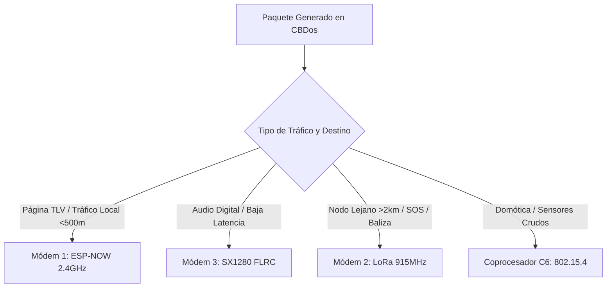

# 📡 Arquitectura de Estación Base y Router Multi-Radio Modular (CBDos)

**Versión:** 1.0  
**Fecha:** 28 de Agosto de 2026  
**Sistema:** CBDos v0.2.1  
**Target Central (Host/Router):** ESP32-P4 RISC-V Dual-Core @ 400 MHz (Guition JC4880P443C)  
**Topología:** Hub USB 2.0 High-Speed Alimentado + Múltiples Puentes Transparentes (ESP32-C3 / LoRa / FLRC)

---

## 🏛️ 1. Visión General del Sistema

Esta arquitectura convierte el CyberDeck **ESP32-P4** en una **Estación Base Táctica y Router de Redes Híbridas (Heterogeneous Mesh Router)**. Mediante el controlador USB High-Speed (480 Mbps) del P4 y un **Hub USB energizado**, el sistema puede conectar simultáneamente múltiples transceptores de radio de bajo consumo que operan como **Puentes Transparentes (Zero-Overhead Transparent Bridges)**.

```
                                  ┌──────────────────────────────────────────────┐
                                  │      ESP32-P4 CYBERDECK (ROUTER HOST)        │
                                  │                                              │
                                  │  • Enrutador Mesh Inteligente (CBDos)        │
                                  │  • Servidor de Contenidos Alternet / Web     │
                                  │  • Monitor Gráfico en Pantalla Táctil 4.3"   │
                                  └──────────────────────┬───────────────────────┘
                                                         │
                                                         │ Puerto USB High-Speed OTG (480 Mbps)
                                                         ▼
                                       ┌───────────────────────────────────┐
                                       │     HUB USB CON ENERGIZACIÓN      │
                                       │   (5V Auxiliar / Batería LiPo)    │
                                       └───┬───────────┬───────────┬───────┘
                                           │           │           │
                    ┌──────────────────────┘           │           └──────────────────────┐
                    ▼                                  ▼                                  ▼
    ┌───────────────────────────────┐  ┌───────────────────────────────┐  ┌───────────────────────────────┐
    │     MÓDEM 1: ESP32-C3 IPEX    │  │     MÓDEM 2: SX1262 / E22     │  │     MÓDEM 3: SX1280 FLRC      │
    │  (Puente Transparente USB)    │  │  (Puente Transparente USB)    │  │  (Puente Transparente USB)    │
    ├───────────────────────────────┤  ├───────────────────────────────┤  ├───────────────────────────────┤
    │ 📡 Radio: ESP-NOW (2.4 GHz)   │  │ 📻 Radio: LoRa 915 / 868 MHz  │  │ ⚡ Radio: FLRC 2.4 GHz / LoRa │
    │ • Ancho de Banda: Alto        │  │ • Ancho de Banda: Bajo        │  │ • Ancho de Banda: Medio/Alto  │
    │ • Alcance: 300m - 1 km        │  │ • Alcance: 5 km - 25 km       │  │ • Latencia: Ultra-Baja (<5ms) │
    │ • Rol: Páginas TLV, Chat P2P  │  │ • Rol: Telemetría de Emergencia│  │ • Rol: Audio Digital P2P      │
    │ • Consumo Reposo: ~25 mA      │  │ • Consumo Reposo: ~12 mA      │  │ • Consumo Reposo: ~15 mA      │
    └───────────────────────────────┘  └───────────────────────────────┘  └───────────────────────────────┘
```

---

## ⚡ 2. Concepto de Puente Transparente (Zero-Overhead Bridge)

Para maximizar la eficiencia energética y la velocidad de respuesta, los microcontroladores satélites (como el **ESP32-C3**) **NO ejecutan lógica pesada ni parsean protocolos complejos**. Actúan estrictamente como tubos de datos bidireccionales:

1. **Recepción desde el Host (P4 ➔ Radio):**
   * El P4 envía una trama enmarcada por el endpoint CDC-ACM.
   * El C3 la pasa directamente a su transmisor de radio (sin demoras ni asignaciones dinámicas de memoria).
2. **Recepción desde el Aire (Radio ➔ P4):**
   * El chip captura un paquete en el aire.
   * Lo encapsula con el micro-header y lo escribe en el endpoint Bulk IN del USB.
3. **Consumo Eléctrico:**
   * En modo escucha (RX), el consumo se mantiene en el piso mínimo (~25-35 mA).
   * Solo hay breves pulsos de potencia durante la transmisión activa de paquetes.

---

## 📐 3. Protocolo de Enmarcado Unificado (CDC ↔ Puentes)

Todos los transceptores en el Hub USB comparten un formato de trama ligero de 5 campos:

```
┌───────────┬──────────────┬───────────────┬──────────────────────────────┬──────────┐
│ Magic 2B  │ Radio Type   │ Longitud 2B   │ Payload (Paquete Mesh CBDos) │ CRC8 1B  │
│ 0xAA 0x55 │ 1 Byte       │ [Len_H][Len_L]│ Hasta 250 Bytes              │ Checksum │
└───────────┴──────────────┴───────────────┴──────────────────────────────┴──────────┘
```

### Identificadores de Radio (`Radio Type`):
* `0x01`: **ESP-NOW 2.4 GHz** (Modo Normal 802.11 b/g/n o Long Range LR).
* `0x02`: **LoRa Sub-GHz** (915 MHz / 868 MHz / 433 MHz).
* `0x03`: **SX1280 2.4 GHz FLRC** (Fast Long Range Communication).
* `0x04`: **IEEE 802.15.4** (Zigbee / Thread Crudo).

---

## 🧠 4. Capa de Enrutamiento Inteligente en el Host (ESP32-P4)

El ESP32-P4 ejecuta el motor **`cbdos::mesh::MeshRouter`**, el cual decide dinámicamente la mejor ruta según el tipo de paquete y la distancia del destinatario:



---

## 🔌 5. Requisitos de Hardware y Energía

* **Hub USB:** Concentrador USB 2.0 (compatible con el estándar USB Host Hub Driver de ESP-IDF `CONFIG_USB_HOST_HUBS_SUPPORTED=y`).
* **Alimentación:**
  * Para evitar caídas de tensión al emitir en múltiples radios simultáneamente a máxima potencia (+20 dBm a +30 dBm), el Hub USB debe contar con su propia toma de 5V (desde batería LiPo compartida o banco de energía).
* **Antenas:**
  * **ESP32-C3:** Conector IPEX/U.FL conectado a antena omnidireccional de 2.4 GHz (5-8 dBi).
  * **Módulo LoRa:** Conector SMA conectado a antena sintonizada de 915 MHz (media onda).

---

## 📈 6. Beneficios Clave del Diseño

1. **Modularidad Total:** Puedes agregar o retirar antenas en caliente simplemente enchufando o desconectando del Hub USB.
2. **Aislamiento de Fallos:** Si un transceptor se daña o pierde señal, el router conmuta automáticamente el tráfico al siguiente medio disponible.
3. **Programabilidad de Campo:** Como el P4 incluye el **Flasher USB-C autónomo**, puedes reprogramar el firmware de cualquiera de los C3 conectados en el Hub en cualquier momento directamente desde la pantalla táctil de CBDos.
