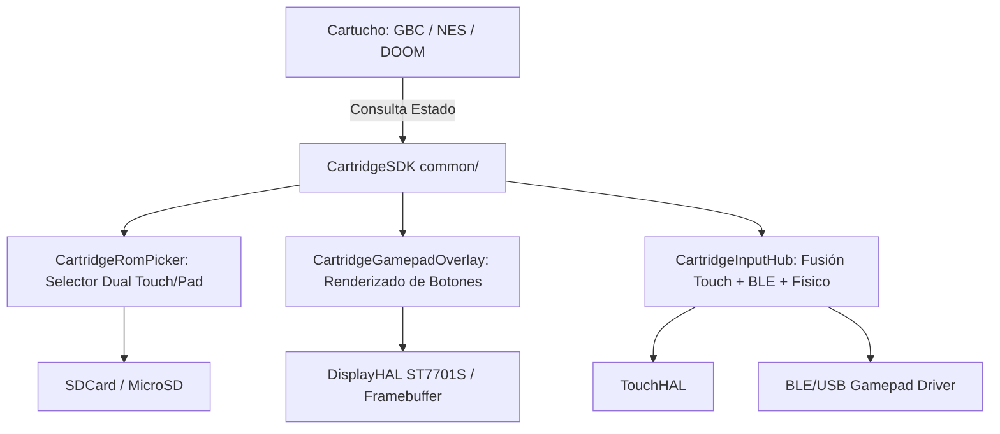

# 🎮 Especificación de Arquitectura e Ingeniería: SDK Universal de Cartuchos y Gamepad Unificado (`CartridgeSDK`)

**Documento:** `specs/architecture/plan_cartridge_sdk_gamepad_universal.md`  
**Versión:** 1.0.0  
**Estado:** Plan de Arquitectura Aprobado para Implementación  
**Módulos Afectados:** `../cbdos-repo/cartridges/common/`, `../cbdos-repo/cartridges/esp32_p4_gbc/`, `esp32_p4_nes`, `esp32_p4_doom`  
**Targets de Hardware:** ESP32-P4 (480x800 ST7701S MIPI-DPI) y ESP32-S3 (320x480 QSPI)  
**Fecha:** Septiembre 2026  

---

## 📌 1. Diagnóstico del Problema y Antecedentes

1. **Anti-patrón de Código Duplicado:** Cada cartucho independiente (`esp32_p4_gbc`, `esp32_p4_nes`, `esp32_p4_doom`) contiene una copia separada de `CartridgeGamepadP4.cpp` de más de 400 líneas, desincronizadas entre sí.
2. **Gamepad Mutilado en Game Boy:** En `esp32_p4_gbc`, el D-Pad son únicamente rectángulos grises cruzados sin ningún tipo de flechas (`▲`, `▼`, `◄`, `►`) ni indicadores. El botón superior derecho dice `MENU` en lugar de `SALIR`.
3. **Selector de ROMs Aislado:** En `main.cpp` (`selectROM`), el bucle interactivo solo lee el bus táctil `TouchHAL`. No admite navegación mediante la cruceta física/gamepad, ignorando comandos direccionales y botones de acción para cargar juegos.
4. **Comportamiento sin ROMs:** Si la tarjeta MicroSD no contiene juegos o no monta en el primer milisegundo, la función `showErrorMessage` fuerza una salida inmediata a CBDos (`exitToOS()`) sin permitir al usuario reintentar el escaneo tras insertar la tarjeta.

---

## 🏛️ 2. Arquitectura del SDK Compartido (`cartridges/common/`)

Se crea una biblioteca común en `../cbdos-repo/cartridges/common/` que compilarán todos los cartuchos (GBC, NES, DOOM, emuladores y juegos futuros):

```
../cbdos-repo/cartridges/common/
├── include/
│   ├── CartridgeInputTypes.hpp     // Enums estándar de botones (PAD_UP, PAD_A, etc.) y layouts
│   ├── CartridgeGamepadOverlay.hpp // Renderizado de mandos táctiles con rótulos, flechas y feedback
│   ├── CartridgeRomPicker.hpp      // Selector de ROMs unificado interactivo (Touch + Gamepad)
│   └── CartridgeInputHub.hpp       // Fusión de entradas (Touch + Mandos Físicos/BLE)
└── src/
    ├── CartridgeGamepadOverlay.cpp
    ├── CartridgeRomPicker.cpp
    └── CartridgeInputHub.cpp
```



---

## 📐 3. Especificaciones Técnicas y Contratos de Código

### 3.1. Máscara de Botones Estándar (`CartridgeInputTypes.hpp`)
Un mapa de bits de 16 bits universal para que cualquier juego consulte el estado de forma idéntica:

```cpp
#pragma once
#include <cstdint>

namespace cbdos::cartridge {

enum GamepadButton : uint16_t {
    PAD_NONE      = 0,
    PAD_UP        = (1 << 0),  // Cruceta Arriba
    PAD_DOWN      = (1 << 1),  // Cruceta Abajo
    PAD_LEFT      = (1 << 2),  // Cruceta Izquierda
    PAD_RIGHT     = (1 << 3),  // Cruceta Derecha
    PAD_A         = (1 << 4),  // Acción Primaria / Salto / Confirmar ROM
    PAD_B         = (1 << 5),  // Acción Secundaria / Cancelar / Volver
    PAD_X         = (1 << 6),  // Acción Terciaria / Strafe L
    PAD_Y         = (1 << 7),  // Uso / Abrir / Strafe R
    PAD_SELECT    = (1 << 8),  // Select
    PAD_START     = (1 << 9),  // Start / Pausa
    PAD_L1        = (1 << 10),
    PAD_R1        = (1 << 11),
    PAD_EXIT      = (1 << 15)  // Retorno Seguro al Sistema Operativo (app0)
};

enum class GamepadLayoutType {
    PortraitGBC,     // Game Boy Color (Juego 480x432 superior, pad inferior)
    PortraitNES,     // NES (Juego superior, layout Famicom inferior)
    PortraitDoom,    // DOOM vertical (D-Pad, Strafe, Run, Fire, Use, Esc, Enter)
};

} // namespace cbdos::cartridge
```

---

### 3.2. Geometría y Coordenadas del Gamepad en ESP32-P4 (480x800)

Para Game Boy Color en el panel de 480x800:
- **Pantalla del juego:** `Y = 0..432` (Escalado exacto x3 de los 160x144 píxeles de Game Boy = 480x432 a 60 FPS puros).
- **Línea divisoria:** `Y = 432..436` (Borde metálico estético).
- **Área del Gamepad:** `Y = 436..800` (364 píxeles de altura).

```
┌──────────────────────────────────────────────┐ (0,0)
│                                              │
│                                              │
│          PANTALLA DE JUEGO (480 x 432)       │
│           Escalado x3 Nativo de GBC          │
│                                              │
│                                              │
├──────────────────────────────────────────────┤ Y = 432 (Borde Divisorio)
│ [ GAME BOY COLOR ]             [ SALIR A OS ]│ Y = 445..485 (Barra Superior)
│                                              │
│        ▲                                     │
│     ◄  ┼  ►                (B)       (A)     │ Y = 500..690 (Cruceta y Botones)
│        ▼                 [Magenta] [Magenta] │
│                                              │
│           [ SELECT ]      [ START ]          │ Y = 715..775 (Menú inferior)
└──────────────────────────────────────────────┘ (480, 800)
```

#### Tabla de Coordenadas de Gráficos y Hitbox:
| Control | Coordenadas / Centro | Gráfico Visual | Rótulo / Indicador |
| :--- | :--- | :--- | :--- |
| **Botón SALIR** | `X: 330..470, Y: 442..488` | Rectángulo rojo redondeado con borde brillante | `"SALIR"` (Blanco, centrado) |
| **D-Pad Arriba** | `X: 70..150, Y: 500..570` | Brazo vertical superior | Flecha `▲` centrada |
| **D-Pad Abajo** | `X: 70..150, Y: 620..690` | Brazo vertical inferior | Flecha `▼` centrada |
| **D-Pad Izquierda** | `X: 20..90, Y: 560..630` | Brazo horizontal izquierdo | Flecha `◄` centrada |
| **D-Pad Derecha** | `X: 130..200, Y: 560..630` | Brazo horizontal derecho | Flecha `►` centrada |
| **Botón B** | `Centro: (310, 620), R=36` | Círculo magenta oscuro con aro brillante | `"B"` centrado |
| **Botón A** | `Centro: (410, 550), R=36` | Círculo magenta oscuro con aro brillante | `"A"` centrado |
| **SELECT** | `X: 90..210, Y: 725..775` | Píldora gris azulada con relieve | `"SELECT"` centrado |
| **START** | `X: 270..390, Y: 725..775` | Píldora gris azulada con relieve | `"START"` centrado |

---

### 3.3. Selector Universal de ROMs (`CartridgeRomPicker`)

El selector universal gestiona la exploración, paginación y carga con navegación dual:

```cpp
namespace cbdos::cartridge {

struct RomPickerConfig {
    const char* systemTitle = "GAME BOY COLOR";
    uint16_t headerColor    = 0x0188; // Azul/Verde retro
    uint16_t accentColor    = 0x07FF; // Cian
    const char* badgeText   = "GBC";
    std::vector<std::string> validExtensions = {".gb", ".gbc", ".cgb"};
    std::vector<std::string> searchPaths = {
        "/sdcard/roms/gbc", "/sdcard/roms/gb", "/sdcard/roms/gameboy",
        "/sdcard/roms", "/sdcard/games", "/sdcard"
    };
};

class CartridgeRomPicker {
public:
    static CartridgeRomPicker& getInstance();
    
    // Bucle interactivo bloqueante.
    // Retorna la ruta absoluta del archivo seleccionado, o cadena vacía si se solicitó salir a CBDos.
    std::string run(const RomPickerConfig& cfg, uint16_t* framebuffer, int width, int height);

private:
    void renderPage(int page, int totalPages, int selectedIndex, const std::vector<std::string>& roms);
    void renderEmptyState(const char* message);
    std::vector<std::string> scanStorage(const RomPickerConfig& cfg);
};

} // namespace cbdos::cartridge
```

#### Funcionalidades Clave del Selector:
1. **Navegación Dual Simultánea:**
   - **Por Pantalla Táctil:** Tocar cualquier juego lo carga. Tocar `PREV`/`NEXT` pagina la lista. Tocar `SALIR` regresa a CBDos.
   - **Por Gamepad (Cruceta y Botones):**
     - `PAD_UP` / `PAD_DOWN`: Mueve la barra de selección entre los juegos de la página.
     - `PAD_LEFT` / `PAD_RIGHT`: Cambia de página (`Page Up` / `Page Down`).
     - `PAD_A`: Carga el juego resaltado.
     - `PAD_B` o `PAD_EXIT`: Sale de regreso a CBDos.
2. **Manejo Amigable de Ausencia de ROMs:**
   - Si no hay juegos en la MicroSD o no se detecta la tarjeta:
     - Muestra un panel informativo claro con las rutas recomendadas (`/sdcard/roms/gbc/`).
     - Ofrece botón `[ REINTENTAR ESCANEO ]` para que el usuario inserte la tarjeta sin reiniciar.
     - Ofrece botón `[ VOLVER A CBDOS ]`.

---

### 3.4. Protocolo de Retorno Seguro al Sistema Operativo (`exitToOS`)
1. Guardar la memoria SRAM / partida en la tarjeta MicroSD (`saveGame()`).
2. Detener las tareas en segundo plano (audio I2S en Core 0).
3. Obtener el descriptor de la partición del sistema base: `esp_partition_find_first(ESP_PARTITION_TYPE_APP, ESP_PARTITION_SUBTYPE_APP_OTA_0, NULL)`.
4. Configurar el arranque con `esp_ota_set_boot_partition()` y reiniciar con `esp_restart()`.

---

## 🛠️ 4. Fases de Ejecución

### Fase 1: Creación del Módulo Universal (`cartridges/common/`)
- [ ] Crear el directorio `../cbdos-repo/cartridges/common/`.
- [ ] Implementar `CartridgeInputTypes.hpp`, `CartridgeGamepadOverlay.cpp` y `CartridgeRomPicker.cpp`.
- [ ] Incluir renderizado de flechas y rótulos en alta visibilidad para el D-Pad y botones.

### Fase 2: Integración en `esp32_p4_gbc`
- [ ] Configurar `CMakeLists.txt` en `esp32_p4_gbc` para enlazar `common/`.
- [ ] Sustituir la lógica monolítica de `main.cpp` con `CartridgeRomPicker::run(...)` y `CartridgeInputHub::read()`.

### Fase 3: Compilación, Flasheo y Verificación
- [ ] Compilar con ESP-IDF (`idf.py build` en `esp32_p4_gbc`).
- [ ] Validar tamaño de binario para la partición `app2` (1.5 MB).
- [ ] Probar en hardware: visualización de flechas, navegación touch + gamepad, reintento sin ROMs y salida limpia a CBDos.

### Fase 4: Propagación a NES y DOOM
- [ ] Conectar el mismo `common/` a `esp32_p4_nes` y `esp32_p4_doom`, eliminando el código duplicado en todo el repositorio.

---

## 🏗️ 5. Abstracción del Ciclo de Vida (`CartridgeAppBase`)

Para **eliminar por completo el boilerplate** (inicialización de LVGL, drivers, SD, etc.) en cada nuevo cartucho, el SDK incluirá una clase base. Esto permite que el gamepad, los menús y los drivers evolucionen centralizadamente sin tocar el código de cada emulador.

### 5.1. Clase `CartridgeAppBase`
El SDK proveerá un punto de entrada que encapsula el hardware y la interfaz:

```cpp
namespace cbdos::cartridge {

class CartridgeAppBase {
public:
    // Inicializa el sistema completo (Hardware, LVGL, Audio, Gamepad, RomPicker)
    void run(const RomPickerConfig& cfg);

protected:
    // Contratos que cada emulador DEBE implementar:
    virtual void onInitCore() = 0; // Inicializar emulador (ej. GbcEmulator::init)
    virtual void onRomSelected(const std::string& romPath) = 0; // Cargar ROM en RAM
    virtual void onEmulatorLoop() = 0; // Tick frame a frame
    virtual void onSaveState() = 0; // Guardar partida al salir
    
    // Acceso a utilidades del SDK
    CartridgeInputHub* getInput();
    CartridgeGamepadOverlay* getOverlay();
};

} // namespace cbdos::cartridge
```

### 5.2. Macro de Punto de Entrada
El archivo principal de cualquier cartucho (ej. `esp32_p4_gbc/main.cpp`) se reducirá a configurar la clase y llamar a una macro, aislando al emulador de las actualizaciones del sistema:

```cpp
#include "CartridgeAppBase.hpp"
#include "GbcEmulatorCore.hpp"

class GBCCartridge : public cbdos::cartridge::CartridgeAppBase {
    void onInitCore() override { GbcEmulator::init(); }
    void onRomSelected(const std::string& romPath) override { GbcEmulator::loadRom(romPath); }
    void onEmulatorLoop() override { GbcEmulator::runFrame(); }
    void onSaveState() override { GbcEmulator::saveSRAM(); }
};

// Genera el app_main() automáticamente
CBDOS_CARTRIDGE_MAIN(GBCCartridge, {
    .systemTitle = "GAME BOY COLOR",
    .headerColor = 0x0188,
    .validExtensions = {".gb", ".gbc"}
})
```

---

## 🌍 6. Entorno de Desarrollo y Desacoplamiento de Repositorios

El ecosistema está diseñado para que **los cartuchos sean entornos de desarrollo completamente aislados** del núcleo del sistema operativo (CBDos).

### 6.1. Integración vía CMake (ESP-IDF)
El `CartridgeSDK` y los drivers base (BSP) actúan como "Componentes". Un cartucho (ej. GBC) puede vivir en su propio repositorio Git o en otra carpeta de la computadora. 

En el `CMakeLists.txt` del cartucho externo, solo se referencia la ruta del SDK:
```cmake
set(EXTRA_COMPONENT_DIRS 
    "path/to/cbdos/cartridges/common"
    "path/to/cbdos/bsp/esp32_p4_jc4880"
)
include($ENV{IDF_PATH}/tools/cmake/project.cmake)
project(esp32_p4_gbc)
```

### 6.2. Ventajas Evolutivas
- **Cero Copia de Código:** Si en el futuro se añade soporte para Gamepads Bluetooth (PS4/Xbox) en `CartridgeInputHub`, **solo se actualiza el SDK en `common/`**. Al recompilar el emulador GBC, hereda mágicamente el soporte Bluetooth sin tocar una sola línea de código del emulador.
- **Independencia de Desarrollo:** Puedes crear un repositorio en GitHub llamado `cbdos-cartridge-doom` y compilarlo sin tener que modificar el código base del sistema operativo. La partición `app0` siempre tendrá CBDos, y flashearás el cartucho en la partición `app1` o `app2`.
