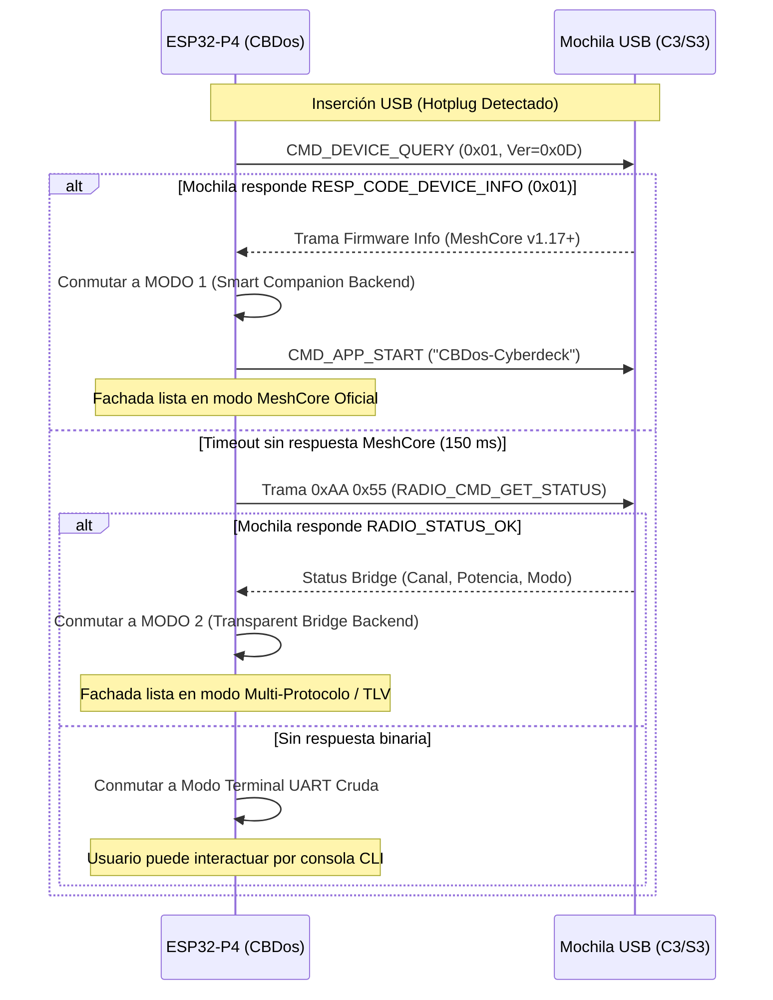

# 📡 Arquitectura Dual de Radio en CBDos: Módems Inteligentes vs. Módems Transparentes

---

## 📌 1. Visión General y Filosofía del Cyberdeck

En el ecosistema de comunicaciones descentralizadas y computación de campo (*Cyberdecks*), existe una aparente contradicción entre dos filosofías de hardware:
1. **La comodidad del ecosistema establecido (Módems Inteligentes):** Módulos que corren firmwares oficiales completos (como **MeshCore Companion** de Liam Cottle o Meshtastic), donde el microcontrolador externo gestiona de forma autónoma la criptografía, las tablas de enrutamiento y la persistencia de contactos.
2. **La libertad absoluta de experimentación (Módems Transparentes / Tontos):** Módulos de radio que operan como puentes ciegos (KISS o enmarcado binario `0xAA 0x55` en ESP-NOW / LoRa), permitiendo al sistema operativo principal emitir cualquier paquete arbitrario (páginas del Navegador TLV de CBDos, balizas de torres, paquetes de CyberPet, sniffing promiscuo e inyección de datos).

**CBDos rechaza la imposición de elegir uno sobre otro.**

La arquitectura definitiva de radio de CBDos implementa un **modelo dual polimórfico**:
* **La Fachada (Frontend en LVGL 9.5):** Es **única, inmutable y unificada**. El usuario siempre interactúa con la misma interfaz táctil: tarjetas de contactos con señal SNR, hilos de chat con burbujas, selector de canales y códigos QR.
* **El Traspatio (Backend Polimórfico):** Se adapta dinámicamente al tipo de mochila conectada al puerto USB Host (o bus SPI interno), conmutando entre un cliente RPC de alto nivel y un motor de procesamiento de paquetes nativo.

---

## 🏗️ 2. Topología Arquitectónica del Sistema Dual

```
┌─────────────────────────────────────────────────────────────────────────────┐
│                       FACHADA / FRONTEND DE CBDOS                           │
│                          (LVGL 9.5 @ 800x480)                               │
│                                                                             │
│  [ Pantalla de Chat ]    [ Directorio Contactos ]    [ Gestor de Canales ]  │
│  * Burbujas de texto     * Tarjetas táctiles         * Públicos / Privados  │
│  * Teclado virtual       * Barras de señal SNR/RSSI  * Exportar / Código QR │
└──────────────────────────────────────┬──────────────────────────────────────┘
                                       │
                         [ Interfaz C++ IRadioClient ]
                   (Eventos: onMessage, onNodeDiscovered)
                                       │
┌──────────────────────────────────────▼──────────────────────────────────────┐
│                    GESTOR DE TRANSPORTE POLIMÓRFICO                         │
│                    (Detección Automática por USB CDC)                       │
└───────────────────┬─────────────────────────────────────┬───────────────────┘
                    │                                     │
                    ▼                                     ▼
┌──────────────────────────────────────┐┌─────────────────────────────────────┐
│      MODO 1: MÓDEM INTELIGENTE       ││     MODO 2: MÓDEM TRANSPARENTE      │
│  (MeshCore Companion Oficial RPC)    ││    (KISS / Bridge Binario Crudo)    │
│                                      ││                                     │
│  El P4 actúa como CLIENTE RPC:       ││  El P4 actúa como MOTOR CENTRAL:    │
│  * CMD_DEVICE_QUERY (Handshake)      ││  * CBDos empaqueta y cifra tramas.  │
│  * CMD_SEND_TXT_MSG (Envío a nodo)   ││  * Multi-protocolo: Navegador TLV,  │
│  * CMD_GET_CONTACTS (Sincronización) ││    MeshCore local, CyberPet o KISS. │
│  * CMD_SEND_TRACE_PATH (Traceroute)  ││  * Control promiscuo y sniffer.     │
└───────────────────┬──────────────────┘└──────────────────┬──────────────────┘
                    │                                      │
                    └──────────────────┬───────────────────┘
                                       │
                    ┌──────────────────▼──────────────────┐
                    │       USB HOST CDC-ACM / SPI        │
                    │  (ESP32-P4 High-Speed OTG @ 12 Mbps)│
                    └──────────────────┬──────────────────┘
                                       │ (Cable USB Tipo-C)
                                       ▼
┌─────────────────────────────────────────────────────────────────────────────┐
│                     MOCHILA EXTERNA DE RADIO (C3 / S3)                      │
│                                                                             │
│  [Escenario A: Con Firmware MeshCore]     [Escenario B: Con Firmware Bridge]│
│  * RadioLib + SX1262 LoRa / ESP-NOW       * Puente CDC a ESP-NOW / LoRa     │
│  * Cripto Curve25519 en la mochila        * Modulación pura de ceros y unos │
│  * Repetidor autónomo si se desconecta    * Antena transparente universal   │
└─────────────────────────────────────────────────────────────────────────────┘
```

---

## 📊 3. Matriz Comparativa: Modo Inteligente vs. Modo Transparente

| Dimensión Técnica | Modo 1: Inteligente (MeshCore RPC) | Modo 2: Transparente (KISS / Bridge) |
| :--- | :--- | :--- |
| **Firmware de la Mochila** | `companion_radio` oficial de Liam Cottle. | `espnow_usb_bridge` o KISS módem transparente. |
| **Carga de CPU en el P4** | Mínima (solo parseo de comandos seriales y UI). | Media (cálculo de criptografía y ruteo en el P4). |
| **Multi-protocolo en Caliente** | No (restringido a la red MeshCore). | **Total** (TLV Browser, MeshCore, Meshtastic, custom). |
| **Comportamiento al Desconectar**| **Autónomo:** Sigue operando como repetidor de campo. | **Inerte:** Requiere al Cyberdeck para procesar datos. |
| **Compatibilidad Comercial** | Alta (enchufar radios comerciales de MeshCore). | Alta (diseñado para experimentación y hacking). |
| **Experiencia de Usuario (UI)** | **Idéntica en la Fachada.** | **Idéntica en la Fachada.** |

---

## 🔍 4. Mecanismo de Negociación y Detección Automática (Handshake)

Cuando el usuario conecta una mochila de radio al puerto USB-C del Cyberdeck, el controlador `UsbDeviceManager` de CBDos dispara un evento de conexión CDC-ACM y ejecuta la siguiente secuencia de detección reactiva:



### Forzado Manual en UI
En la pantalla de configuración (`ConfigView` / `RadioConfig`), el usuario dispondrá de un selector manual para invalidar la detección automática si desea forzar un modo específico:
* `[Auto-detectar]` (Predeterminado)
* `[Forzar MeshCore Companion]`
* `[Forzar Puente Transparente / TLV]`
* `[Terminal Serial Directa]`

---

## 💻 5. Diseño de Interfaces de Software (C++ / Core)

Para garantizar la **Ley de Pureza Arquitectónica de `core/`**, la interfaz no depende de ningún driver físico de ESP-IDF ni Arduino:

```cpp
namespace cbdos::radio {

enum class RadioModemType {
    Unknown,
    SmartMeshCore,      // Protocolo RPC oficial de MeshCore
    TransparentBridge,  // Módem de paquetes crudos (KISS / Bridge)
    RawSerialTerminal   // Terminal de texto libre
};

struct NodeContact {
    uint8_t pubKey[32];
    char name[32];
    int8_t lastRssi;
    int8_t lastSnr;
    uint8_t hops;
    uint32_t lastSeenEpoch;
};

class IRadioBackend {
public:
    virtual ~IRadioBackend() = default;
    virtual bool init() = 0;
    virtual void stop() = 0;
    virtual RadioModemType getType() const = 0;

    // Métodos universales consumidos por la Fachada
    virtual bool sendMessage(const uint8_t* destPubKey, const std::string& text) = 0;
    virtual bool sendBroadcast(uint16_t channelIndex, const std::string& text) = 0;
    virtual std::vector<NodeContact> getDiscoveredNodes() = 0;

    // Callbacks reactivos hacia la UI (LVGL 9.5)
    using MessageCallback = std::function<void(const NodeContact& from, const std::string& text)>;
    using NodeDiscoveredCallback = std::function<void(const NodeContact& node)>;

    virtual void setMessageCallback(MessageCallback cb) = 0;
    virtual void setNodeDiscoveredCallback(NodeDiscoveredCallback cb) = 0;
};

} // namespace cbdos::radio
```

---

## 🗺️ 6. Hoja de Ruta para la Implementación (Fase 2)

1. **Hito 2.1: Driver Serial USB Host Robusto:**
   * Implementar en `bsp/esp32_p4_jc4880/hal/` el transporte reactivo libre de bloqueos con colas de FreeRTOS para tramas binarias de tamaño variable.
2. **Hito 2.2: Implementación de `SmartCompanionRadioBackend`:**
   * Mapear los comandos oficiales de MeshCore (`CMD_APP_START`, `CMD_SEND_TXT_MSG`, `CMD_GET_CONTACTS`, `CMD_SYNC_NEXT_MESSAGE`).
3. **Hito 2.3: Implementación de `TransparentBridgeRadioBackend`:**
   * Conectar el motor nativo existente `MeshEngine.cpp` (TLV Browser y balizas de torres) para que use la misma abstracción.
4. **Hito 2.4: Construcción de la Fachada Unificada en LVGL 9.5:**
   * Diseñar la vista táctil `RadioUnifiedView`:
     - Pestaña de Chat con teclado táctil y vista de burbujas.
     - Pestaña de Contactos con indicadores de señal y salto.
     - Pestaña de Malla con información de repetidores y rutas.
     - Pestaña de Diagnóstico de Radio (frecuencia, potencia, cambio de modo dinámico).
