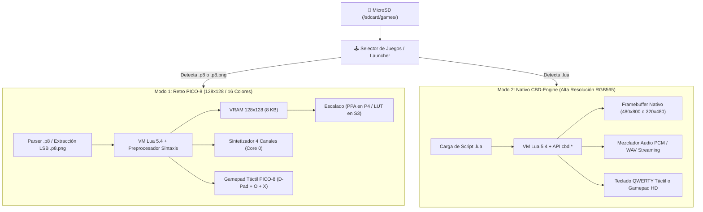
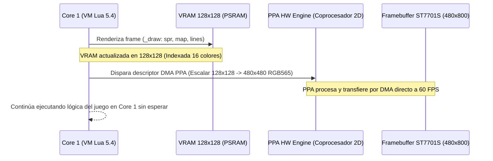
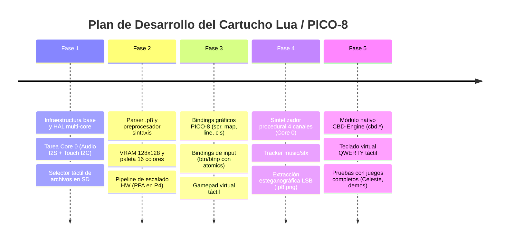

# Especificación Técnica de Arquitectura: Cartucho Dual Lua 5.4 & PICO-8 Engine (CBDos)

**Estado:** Documento de Arquitectura y Diseño Técnico  
**Fecha:** 2026-08-22  
**Targets Soportados:**  
* 🚀 **ESP32-P4:** RISC-V Dual-Core @ 400 MHz (Guition JC4880P443C - 480x800 MIPI-DPI con PPA)  
* ⚡ **ESP32-S3:** Xtensa LX7 Dual-Core @ 240 MHz (JC3248W535 - 320x480 QSPI / SPI)  
**Ubicación de Cartuchos:** `cartridges/esp32_p4_lua/` y `cartridges/esp32_s3_lua/`  
**Módulo Núcleo Compartido:** `cartridges/common_lua_engine/`

---

## 1. Visión y Modos de Operación

El motor de Lua para CBDos opera como un **cartucho standalone** en una partición OTA dedicada, ejecutándose directamente sobre el hardware sin la sobrecarga de LVGL. Detecta automáticamente el tipo de archivo seleccionado desde la MicroSD y se configura en uno de dos modos:



### Comparativa Detallada de Modos

| Característica | 🕹️ Modo 1: Retro PICO-8 | 💻 Modo 2: Nativo CBD-Engine |
| :--- | :--- | :--- |
| **Archivos Soportados** | `.p8` (código fuente), `.p8.png` (cartucho con imagen) | `.lua` (scripts de sistema o juegos HD) |
| **Espacio de Color** | 16 colores canónicos (expandible a 32 con paleta oculta) | 65.536 colores (RGB565 nativo de 16 bits) |
| **Resolución Lógica** | $128 \times 128$ píxeles (VRAM indexada de 4 bits por pixel) | Hasta $480 \times 800$ (P4) o $320 \times 480$ (S3) |
| **Escalado a Pantalla** | Acelerado por HW (PPA en P4) o LUT en S3 a pantalla completa | Render 1:1 directo en el framebuffer |
| **Sistema de Sonido** | Sintetizador procedural de 4 canales (`sfx`, `music`) | Reproducción WAV y mezclador PCM polifónico |
| **Interfaz de Control** | Gamepad virtual retro (D-Pad circular, botones 🅾️ y ❎) | Teclado virtual QWERTY completo o controles HD |
| **Entorno de API** | Funciones globales PICO-8 (`spr`, `map`, `pget`, `btn`, etc.) | Módulo global `cbd.*` (`cbd.gfx`, `cbd.audio`, etc.) |

---

## 2. Arquitectura Multi-Target (ESP32-P4 vs ESP32-S3)

Para evitar duplicar código y mantener el principio de **código agnóstico** de CBDos, la arquitectura desacopla el motor lógico de los drivers de pantalla y hardware:

```
cartridges/
├── common_lua_engine/          <-- 🟢 100% CÓDIGO COMPARTIDO Y AGNÓSTICO
│   ├── lua_core/               # Intérprete Lua 5.4 compilado para PSRAM
│   ├── pico8/
│   │   ├── P8Cartridge.cpp     # Parser de bloques __lua__, __gfx__, __map__, __sfx__
│   │   ├── P8Preprocessor.cpp  # Preprocesador de sintaxis (+=, !=, shorthand if)
│   │   ├── P8Api.cpp           # Funciones matemáticas, memoria y dibujo
│   │   └── P8Synth.cpp         # Sintetizador procedural de 4 canales en tiempo real
│   ├── cbd_engine/
│   │   ├── CbdApi.cpp          # Módulo global cbd.* (gfx, audio, input, storage)
│   │   └── VirtualKeyboard.cpp # Lógica y dibujo del teclado QWERTY táctil
│   └── shared/
│       ├── SharedState.hpp     # Estructuras atómicas inter-núcleo (Lock-Free)
│       └── AsyncFS.hpp         # Colas para operaciones no bloqueantes con la SD
│
├── esp32_p4_lua/               <-- 🚀 TARGET ESP32-P4 (ESP-IDF 5.5)
│   └── main/hal/
│       ├── HalDisplayP4.cpp    # Driver ST7701S (MIPI-DPI) + Coprocesador PPA HW
│       ├── HalAudioP4.cpp      # Driver I2S DMA + Códec ES8311
│       └── HalTouchP4.cpp      # GT911 I2C en Core 0
│
└── esp32_s3_lua/               <-- ⚡ TARGET ESP32-S3 (PlatformIO / ESP-IDF)
    └── main/hal/
        ├── HalDisplayS3.cpp    # Driver QSPI/SPI + Escalador por Software con LUT
        ├── HalAudioS3.cpp      # Driver I2S DAC / Códec específico
        └── HalTouchS3.cpp      # Driver Táctil I2C en Core 0
```

---

## 3. Pipeline Gráfico y Escalado: PPA (P4) vs LUT (S3)

Uno de los mayores retos al emular PICO-8 ($128 \times 128$) en pantallas de mayor resolución es el costo de procesamiento del escalado. Cada plataforma utiliza una estrategia óptima adaptada a su silicio:

### 🚀 En ESP32-P4: Aceleración por Hardware con PPA (0% CPU)

El ESP32-P4 cuenta con el **PPA (Pixel Processing Accelerator)**, un coprocesador 2D DMA capaz de realizar escalado de imagen, conversión de formato de color y rotación en tiempo real sin consumir ciclos de CPU:



* **Factor de Escalado:** $128 \times 128 \longrightarrow 480 \times 480$ (escalado entero/bilineal por hardware centrado en pantalla).
* **Consumo de CPU:** **0%**. El Core 1 queda 100% libre para la lógica del script.

---

### ⚡ En ESP32-S3: Escalado por Software Optimizado con Tablas LUT y DMA

Dado que el ESP32-S3 no cuenta con coprocesador PPA, el escalado de $128 \times 128$ a la resolución de $320 \times 480$ (o $320 \times 320$) se realiza mediante un algoritmo de líneas duplicadas con tabla de búsqueda (**LUT - Look-Up Table**):

1. **Tabla de Color Precalculada:** Convierte el índice de color de 4 bits de PICO-8 directamente a un píxel RGB565 de 16 bits en 1 ciclo de instrucción.
2. **Escalado Horizontal (Nearest Neighbor con LUT):** Cada fila de 128 píxeles se expande a un búfer intermedio de línea de 320 píxeles.
3. **Duplicación Vertical y Volcado DMA:** Las líneas escaladas se envían a la pantalla por bus QSPI/SPI usando transferencias DMA de fondo.

---

## 4. Distribución Multi-Core Asimétrica (Zero-Stuttering)

Para eliminar cualquier posibilidad de caídas de fotogramas (*frame drops*) producidas por operaciones bloqueantes de periféricos (I2C, MicroSD, códec de audio), el trabajo se reparte de forma asimétrica entre los dos núcleos:

```mermaid
graph TB
    subgraph CORE_0["Core 0: E/S de Periféricos, Audio e Input Polling"]
        direction TB
        A1["🔊 Sintetizador P8Synth (4 Canales a 44.1 kHz)"]
        A2["⚡ Driver DMA I2S (Códec ES8311)"]
        B1["👆 Muestreador Táctil I2C (GT911 a 120 Hz)"]
        B2["🎮 Decodificador de Zonas Táctiles (D-Pad, Botones, Teclas)"]
        C1["💾 Tarea E/S MicroSD Asíncrona (cartdata, dset/dget)"]
        D1["📊 Monitor de FPS/CPU & Menú de Pausa In-Game"]
    end

    subgraph SHARED["Memoria Compartida (PSRAM / Atomics Lock-Free)"]
        direction TB
        S_AUDIO["RingBuffer de Comandos SFX / Music"]
        S_INPUT["Atomic Bitmask de Entrada (btn_state / btnp_state)"]
        S_FS["Cola de Mensajes FreeRTOS para E/S SD"]
        S_VRAM["VRAM 128x128 / Framebuffer Nativo"]
    end

    subgraph CORE_1["Core 1: Motor de Juego, VM Lua y Render Puro"]
        direction TB
        L1["🧠 VM Lua 5.4 (_init / _update60 / _draw / GC)"]
        L2["🎨 Rasterizador Gráfico (spr, map, line, cls, cbd.gfx)"]
        L3["🖼️ Disparo de Flush de Pantalla (PPA / DMA)"]
    end

    CORE_1 -->|Encola evento 'sfx(n)'| S_AUDIO
    S_AUDIO --> A1
    A1 --> A2

    B1 --> B2
    B2 -->|Actualiza bitmask atómico| S_INPUT
    CORE_1 -->|Lee 'btn()' en 1 ciclo de reloj| S_INPUT

    CORE_1 -->|Solicita guardar partida sin bloquear| S_FS
    S_FS --> C1

    L1 --> L2
    L2 --> S_VRAM
    S_VRAM --> L3
```

### ¿Por qué esta distribución hace que el Core 1 lo tenga fácil?

1. **Lectura Instantánea de Controles (`btn()` / `btnp()`):**  
   En lugar de que el bucle de juego detenga la CPU para dialogar con el chip táctil GT911 por I2C (lo que toma entre 1 y 2 ms por frame), el **Core 0 muestrea el táctil a 120 Hz** de forma independiente y escribe el estado en una máscara de bits atómica (`uint16_t`). Cuando el script Lua invoca `btn(0)`, la función C++ simplemente lee esa variable en **1 ciclo de CPU**.

2. **Aislamiento Total del Audio:**  
   El sintetizador procedural y el tracker de 4 canales se ejecutan enteramente en el Core 0. Si un script en Lua realiza cálculos intensivos de física o IA en el Core 1, el audio continuará fluyendo por DMA sin el más mínimo chasquido o interrupción.

3. **Operaciones de Disco No Bloqueantes (`AsyncFS`):**  
   Las funciones de guardado persistente (`cartdata()`, `dset()`, `dget()`) envían una solicitud a la cola del Core 0. La escritura física en los bloques de la MicroSD se realiza en segundo plano, evitando los típicos congelamientos de 30–80 ms provocados por la latencia de la memoria Flash NAND.

---

## 5. Estructura de Memoria y Sincronización Inter-Core (Lock-Free)

Para evitar el bloqueo mutuo (*deadlocks*) o retrasos por contención de semáforos, la comunicación entre núcleos se basa en **estructuras sin bloqueo (Lock-Free)**:

```cpp
// Estructura de sincronización sin bloqueos (Zero-Lock)
struct CartridgeSharedState {
    // 1. Estado atómico de botones (actualizado por Core 0 a 120 Hz, leído por Core 1)
    std::atomic<uint16_t> btn_state{0};       // Bits: 0=Left, 1=Right, 2=Up, 3=Down, 4=O, 5=X, 6=Pause
    std::atomic<uint16_t> btnp_state{0};      // Flancos de subida (pulsación inicial)
    
    // 2. Coordenadas táctiles analógicas (para modo CBD nativo)
    std::atomic<int16_t> touch_x{-1};
    std::atomic<int16_t> touch_y{-1};
    std::atomic<bool>    touch_pressed{false};

    // 3. Ringbuffer lock-free SPSC (Single Producer Single Consumer) para comandos de audio
    static constexpr size_t AUDIO_QUEUE_SIZE = 32;
    struct AudioCommand {
        uint8_t  type;       // 0=SFX, 1=MUSIC, 2=STOP
        int8_t   id;         // Número de SFX o patrón de música
        int8_t   channel;    // Canal 0..3 (-1 = auto)
        int16_t  offset;     // Offset de inicio
    };
    AudioCommand audio_queue[AUDIO_QUEUE_SIZE];
    std::atomic<size_t> audio_head{0};
    std::atomic<size_t> audio_tail{0};
};
```

---

## 6. Plan de Implementación por Fases



---

## 7. Criterios de Calidad y Rendimiento

* **Fluidez:** 60 FPS estables en juegos complejos de PICO-8 con partículas y mapas completos.
* **Latencia de Entrada:** Menor a 8 ms entre el toque táctil en pantalla y la respuesta del sprite en el juego.
* **Calidad de Audio:** Cero cortes (*underruns*) de I2S durante cargas de datos en SD o picos de CPU en Lua.
* **Estabilidad del Sistema:** Retorno inmediato y seguro al menú principal de CBDos sin fugas de memoria en PSRAM.
