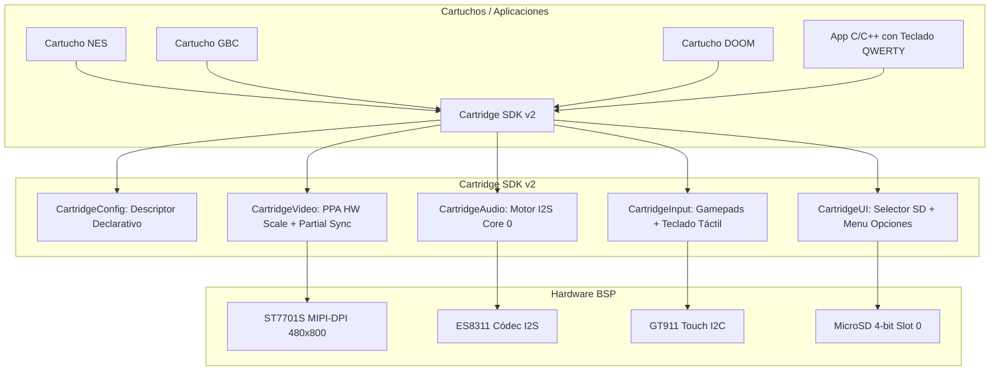

# Borrador de Diseño Técnico: Cartridge SDK v2 (CBDos / ESP32-P4)

**Estado:** Borrador de Arquitectura / Propuesta Técnica  
**Fecha:** 2026-08-20  
**Target Principal:** ESP32-P4 RISC-V Dual-Core @ 400 MHz (JC4880P443C)  
**Compatibilidad Futura:** Target ESP32-S3 (JC3248W535)  

---

## 1. Motivación y Diagnóstico Actual

En la versión actual de los cartuchos de CBDos (`esp32_p4_nes`, `esp32_p4_gbc`, `esp32_p4_doom`), cada ejecutable implementa de forma aislada:
1. Primitivas gráficas y renderizado básico de texto.
2. Explorador y selector de ROMs en tarjeta MicroSD.
3. Menú de pausa in-game (volumen, cambio de ROM, salida a CBDos).
4. Inicialización de periféricos HAL (Display, Audio, Touch, SD).
5. Gamepad táctil en pantalla.

### Cuellos de Botella Detectados en Cartuchos Actuales:
* **Escalado por CPU:** En emuladores como NES, el escalado $256 \times 240 \to 480 \times 450$ se realiza por software mediante bucles en C++ con $216,000$ divisiones enteras por fotograma, ignorando el acelerador **PPA (Pixel Processing Accelerator)** del ESP32-P4.
* **Flushing Ineficiente de Caché:** Se ejecutan llamadas a `esp_cache_msync()` sobre los $768\text{ KB}$ completos del panel ($480 \times 800$), sincronizando continuamente el área del gamepad estático en cada frame.
* **Audio Bloqueante:** Algunos cartuchos ejecutan llamadas I2S bloqueantes en el mismo núcleo que la emulación (Core 1), provocando microcortes y pérdida de FPS.
* **Falta de Modularidad de Entrada:** No existe soporte para teclados virtuales que permitan ejecutar aplicaciones nativas interactivas en C/C++ (como terminales, consolas, o intérpretes de comandos).

---

## 2. Visión del Cartridge SDK v2

El **Cartridge SDK v2** estandariza una capa base (`cartridges/common/sdk_v2`) para que cualquier cartucho (emulador o aplicación nativa C/C++) se configure de forma declarativa y obtenga automáticamente:

1. **Aceleración Gráfica PPA por Hardware:** Escalado y blitting sin consumo de CPU.
2. **Refresco Inteligente:** El gamepad o teclado se dibuja 1 sola vez; solo se sincroniza la región activa del juego ($Y=0 \dots \text{displayHeight}$).
3. **Audio Autónomo en Core 0:** Tarea I2S DMA continua e independiente con sincronización por semáforo para garantizar 60 FPS estables.
4. **Input Modular Configurable:** Gamepads (`NES`, `GBC`, `DOOM`, `SNES`) y **Teclado Virtual QWERTY** completo para aplicaciones C/C++.
5. **Servicios de UI Unificados:** Selector de ROMs con paginación táctil, menú de pausa in-game y retorno limpio a CBDos por OTA.



---

## 3. Especificación de Módulos del SDK v2

### 3.1. Descriptor de Configuración (`CartridgeConfig.hpp`)

```cpp
#pragma once
#include <cstdint>
#include <cstddef>

enum CartridgeInputLayout {
    LAYOUT_NONE = 0,
    LAYOUT_NES,           // D-Pad + A/B + Select/Start + Menu
    LAYOUT_GBC,           // D-Pad + A/B + Select/Start + Menu
    LAYOUT_DOOM,          // D-Pad + Fire/Use/Act/Run + Esc/Enter/Menu
    LAYOUT_SNES,          // D-Pad + A/B/X/Y + L/R + Select/Start + Menu
    LAYOUT_QWERTY_KEYBOARD,// Teclado alfanumérico completo táctil
    LAYOUT_FULLSCREEN_TOUCH// 100% pantalla táctil para la app
};

enum CartridgeColorFormat {
    COLOR_RGB565,
    COLOR_PALETTE8,
    COLOR_ARGB8888
};

struct CartridgeConfig {
    const char* appTitle;            // Nombre de la App/Juego
    const char* romExtension;        // ".nes", ".gbc", ".wad", etc. (nullptr si es app nativa)
    const char* defaultRomFolder;    // "/sdcard/roms/nes"
    
    // Dimensiones nativas del motor
    int nativeWidth;                 // Ej. 256
    int nativeHeight;                // Ej. 240
    
    // Dimensiones en pantalla (área de video)
    int displayWidth;                // 480
    int displayHeight;               // 450 (dejando 350px para controles)
    int displayOffsetY;              // 0
    
    CartridgeColorFormat colorFormat;// Formato de píxeles nativo
    bool useHardwarePpa;             // true = usar acelerador PPA del ESP32-P4
    
    // Audio
    int audioSampleRate;             // Ej. 22050, 32768, 44100 Hz
    bool enableCore0Audio;           // true = tarea independiente en Core 0
    
    // Controles
    CartridgeInputLayout inputLayout;
};
```

---

### 3.2. Motor de Video y Aceleración PPA (`CartridgeVideo`)

1. **Escalado PPA (ESP32-P4):**
   * Configura una instancia de `ppa_client_handle_t` en modo `PPA_OPERATION_SRM` (Scale, Rotate, Mirror) o Blit de color.
   * Transfiere el búfer nativo ($256 \times 240$) al búfer de pantalla ($480 \times 450$) a través del bus AXI en una fracción de milisegundo.
2. **Volcado Inteligente de Memoria Caché:**
   * El Gamepad o Teclado se dibuja una sola vez al cargar el juego en el rango $Y = 450 \dots 800$.
   * En cada fotograma de emulación se invoca:
     ```cpp
     esp_cache_msync(s_activeFb, 480 * config.displayHeight * sizeof(uint16_t),
                     ESP_CACHE_MSYNC_FLAG_DIR_C2M | ESP_CACHE_MSYNC_FLAG_UNALIGNED);
     ```
   * **Ahorro:** Pasa de volcar $768\text{ KB}$ a solo $432\text{ KB}$ por frame (reducción del 44% en tráfico de memoria).

---

### 3.3. Motor de Audio Autónomo (`CartridgeAudio`)

* Tarea dedicada en **Core 0** (`CartridgeAudioTask`).
* El emulador o app en **Core 1** deposita muestras en un búfer circular de baja latencia o ejecuta una función callback de audio sin bloquear el bucle de renderizado.
* Sincronización mediante semáforo contador (`s_frameSync`) para asegurar una cadencia de 60.0 FPS perfecta ligada al reloj de audio I2S.

---

### 3.4. Sistema de Entrada Modular y Teclado QWERTY (`CartridgeInput`)

Permite alternar entre gamepads y teclado virtual según la necesidad del cartucho:

```
+-------------------------------------------------------------+
|                                                             |
|               Área de Video / Juego / App                   |
|                      (480 x 450)                            |
|                                                             |
+-------------------------------------------------------------+
|                       BARRA DIVISORIA                       |
+-------------------------------------------------------------+
|                 ÁREA DE ENTRADA TÁCTIL                      |
|                      (480 x 350)                            |
|                                                             |
|  [Opción A: Gamepad NES/GBC]    [Opción B: Teclado QWERTY]  |
|     (D-Pad + A/B + Sel/Start)      (Q W E R T Y U I O P...) |
|                                    (A S D F G H J K L ...)  |
|                                    ( Z X C V B N M [<-] )   |
|                                    ([SHIFT]  [ESPACIO] [RET])|
+-------------------------------------------------------------+
```

#### Eventos de Teclado para Apps C/C++:
```cpp
struct KeyEvent {
    char ascii;        // 'a', 'Z', '1', '\n', '\b', etc.
    bool isSpecial;    // Teclas de control (F1, ESC, TAB)
    bool pressed;      // true = pulsada, false = liberada
};

// Callback registrado por la aplicación C/C++:
void onKeyInput(const KeyEvent& ev);
```

Esto permite ejecutar en un cartucho:
- Intérpretes (BASIC, Lua, MicroPython, Forth).
- Consolas de depuración y terminales interactivas.
- Editores de texto y código fuente ligeros.
- Emuladores de ordenadores de 8/16 bits (ZX Spectrum, Commodore 64, MSX, Apple II).

---

### 3.5. Servicios de UI y Navegación (`CartridgeUI`)

* **`CartridgeUI::selectRom()`:** Selector visual con búsqueda recursiva de archivos en SD (`/sdcard/roms/...`), paginación fluida, nombres limpios y selector táctil.
* **`CartridgeUI::showInGameMenu()`:** Tarjeta flotante semi-transparente para:
  - Ajuste de volumen analógico (0-100%).
  - Guardar y cargar partida en flash/SD (archivos `.sav`).
  - Cambiar de ROM sin reiniciar.
  - Salir a CBDos (ejecuta cambio seguro de partición OTA y reinicio).
* **`CartridgeUI::showError()`:** Presentación visual de errores críticos (SD no insertada, ROM incompatible, etc.).

---

## 4. Ejemplo de Implementación de un Cartucho con SDK v2

Así de conciso quedará el archivo `main.cpp` de cualquier cartucho (ej. NES):

```cpp
#include "CartridgeSDK.hpp"

// Configuración declarativa
static const CartridgeConfig kNesConfig = {
    .appTitle          = "Nintendo Entertainment System",
    .romExtension      = ".nes",
    .defaultRomFolder  = "/sdcard/roms/nes",
    .nativeWidth       = 256,
    .nativeHeight      = 240,
    .displayWidth      = 480,
    .displayHeight     = 450,
    .displayOffsetY    = 0,
    .colorFormat       = COLOR_PALETTE8,
    .useHardwarePpa    = true,
    .audioSampleRate   = 22050,
    .enableCore0Audio  = true,
    .inputLayout       = LAYOUT_NES
};

extern "C" void app_main(void) {
    // 1. Inicializar SDK y Hardware
    CartridgeSDK::init(kNesConfig);

    // 2. Bucle de ejecución del cartucho
    while (true) {
        std::string romPath = CartridgeUI::selectRom(kNesConfig);
        if (romPath.empty()) {
            CartridgeSDK::exitToOS();
            return;
        }

        // Cargar ROM y arrancar emulador
        if (loadNesRom(romPath.c_str())) {
            CartridgeSDK::runEmulationLoop([]() {
                // Ejecución de 1 frame de emulación
                runNesFrame();
                
                // Presentar video con aceleración PPA
                CartridgeVideo::present(getNesFramebuffer(), getNesPalette());
                
                // Comprobar eventos de gamepad o menú
                uint32_t btns = CartridgeInput::readButtons();
                if (btns & PAD_MENU) {
                    CartridgeUI::showInGameMenu();
                }
            });
        }
    }
}
```

---

## 5. Fases de Despliegue

1. **Fase 1:** Construir la biblioteca en `cartridges/common/sdk_v2`.
2. **Fase 2:** Migrar `esp32_p4_nes` al SDK v2 y verificar los 60 FPS estables con PPA.
3. **Fase 3:** Migrar `esp32_p4_gbc` y `esp32_p4_doom` para eliminar redundancias.
4. **Fase 4:** Crear una plantilla de cartucho C/C++ con teclado táctil virtual (`cartridges/esp32_p4_app_template`).
