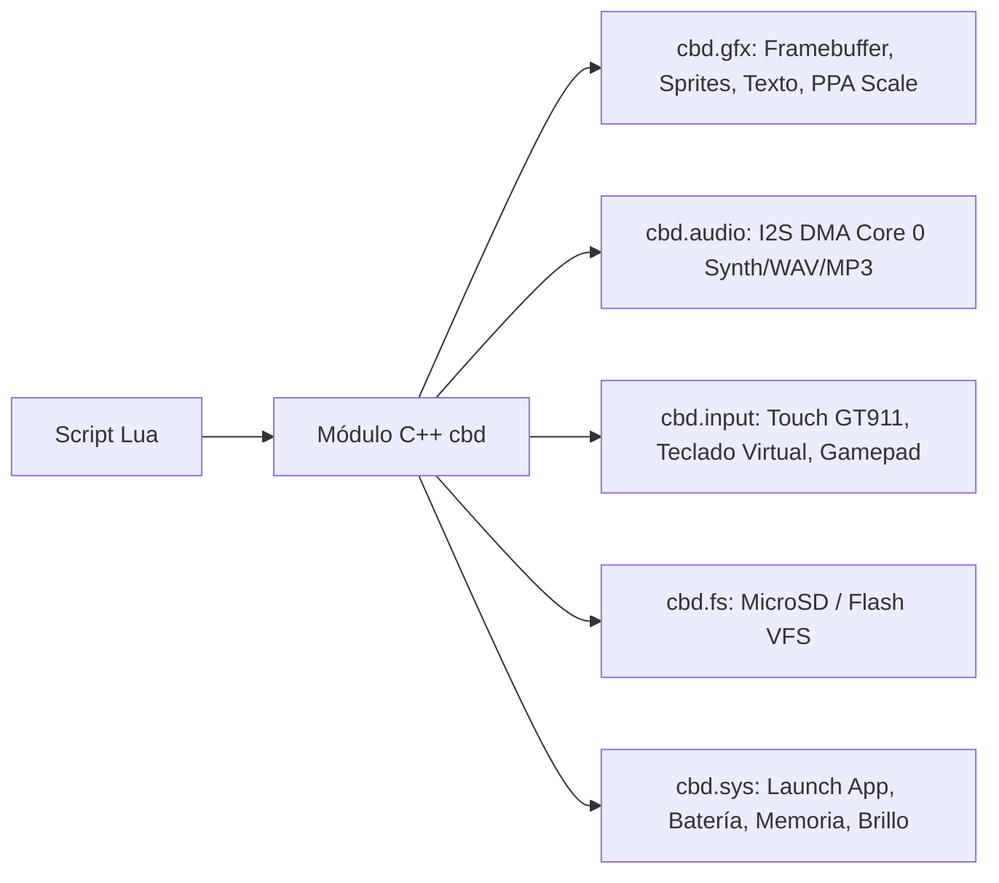

# Borrador de Arquitectura Experimental: CBDos Lua Native Shell (GUI & Desktop en Lua)

**Estado:** Borrador de Arquitectura / Propuesta Experimental (Para rama futura)  
**Fecha:** 2026-08-22  
**Target:** ESP32-P4 RISC-V @ 400 MHz & ESP32-S3 @ 240 MHz  
**Ubicación Documento:** `docs/BORRADOR_LUA_NATIVE_SHELL_GUI.md`  

---

## 1. Concepto y Visión

Este borrador explora una arquitectura alternativa / experimental en la que la **interfaz de usuario (Desktop, Launcher, Barra de Tareas y Aplicaciones)** del sistema operativo se ejecutan directamente en **Lua 5.4**, dibujando sobre un motor gráfico 2D nativo ultraligero en lugar de usar un framework pesado como LVGL.

### Motivación:
* **Peso y Memoria:** Reducir el consumo de Flash (de ~1 MB a <200 KB) y simplificar el uso de RAM al no requerir el árbol de widgets retained mode de LVGL.
* **Hot-Reloading Dinámico:** Poder editar y personalizar el launcher, temas visuales, widgets y aplicaciones directamente modificando archivos `.lua` en la tarjeta MicroSD sin necesidad de recompilar ni flashear el firmware C++.
* **Ecosistema Accesible:** Permitir a cualquier usuario crear y distribuir aplicaciones (`.lua`) y juegos (`.p8`) simplemente guardándolos en la tarjeta SD.

---

## 2. Comparativa Arquitectónica: LVGL vs Lua Native Shell

```mermaid
graph TD
    subgraph Modelo Actual (LVGL 9.5)
        FW1[Firmware C++] --> LVGL[LVGL Core / Widgets / Estilos]
        LVGL --> UI_C[Vistas de UI compiladas en C++]
        FW1 --> CARTRIDGES[Lanzador de Cartuchos Separados]
    end

    subgraph Modelo Experimental (Lua Native Shell)
        FW2[Firmware C++ Minimal] --> HAL_ENGINE[Motor 2D / Framebuffer Directo / DMA]
        HAL_ENGINE --> LUA_VM[Lua 5.4 VM en PSRAM]
        LUA_VM --> DESKTOP_LUA["/sdcard/system/desktop.lua (Launcher)"]
        LUA_VM --> APPS_LUA["/sdcard/apps/*.lua (Calculadora, Chat, etc.)"]
        LUA_VM --> P8_GAMES["/sdcard/games/*.p8 (Juegos PICO-8)"]
    end
```

| Métrica | Enfoque LVGL 9.5 (Rama Principal) | Enfoque Lua Native Shell (Rama Experimental) |
| :--- | :--- | :--- |
| **Tamaño de Binario Flash** | ~1.5 MB - 2.5 MB | **~500 KB - 800 KB** (C++ Base + Lua VM) |
| **Consumo de Memoria RAM** | Medio-Alto (árbol de widgets LVGL) | **Bajo / Predecible** (Todo gestionado por Lua en PSRAM) |
| **Ciclo de Desarrollo UI** | Recompilar C++ y flashear por USB | **Guardar script en MicroSD y recargar en caliente** |
| **Animaciones & 60 FPS** | Limitado por cálculos de layout LVGL | **60 FPS constantes** vía DMA / Acelerador PPA en P4 |
| **Complejidad de Widgets** | Fácil (widgets complejos ya hechos) | Media (se programan o usan librerías GUI en Lua) |

---

## 3. Arquitectura del Firmware C++ Base (Micro-Kernel)

El firmware C++ actúa únicamente como un **HAL de Alto Rendimiento** que expone una tabla global `cbd.*` a la máquina virtual de Lua:

### 3.1. Módulos de la API `cbd`:



* **`cbd.gfx`:** Primitivas 2D (`cls`, `rect`, `rectfill`, `circle`, `line`, `draw_sprite`, `draw_image`, `print_text`, `clip`, `set_palette`).
* **`cbd.audio`:** Reproducción de audio y síntesis (`play_wav`, `play_tone`, `sfx`, `music`, `set_volume`).
* **`cbd.input`:** Eventos táctiles y botones (`get_touch`, `is_pressed`, `get_key`, `btn`, `btnp`).
* **`cbd.sys`:** Gestión de energía y arranque (`launch(path)`, `battery_level()`, `get_free_psram()`, `set_brightness(val)`).

---

## 4. Estructura de Archivos en la MicroSD (`/sdcard/`)

```text
/sdcard/
├── system/
│   ├── desktop.lua        # Script principal que dibuja el Launcher / Escritorio
│   ├── theme.lua          # Paletas, fuentes y configuración visual
│   ├── icons.png          # Spritesheet de iconos del sistema
│   └── lib/
│       ├── gui.lua        # Librería de widgets en Lua (Botones, Listas, Sliders)
│       └── keyboard.lua   # Teclado táctil QWERTY virtual
├── apps/
│   ├── chat.lua           # Cliente de mensajería Mesh
│   ├── files.lua          # Explorador de archivos de la MicroSD
│   ├── calc.lua           # Calculadora
│   └── notes.lua          # Bloc de notas
└── games/
    ├── celeste.p8         # Juego PICO-8
    └── demo_game.lua      # Juego nativo en Lua
```

---

## 5. Ejemplo de Flujo de Ejecución (Ciclo de Vida)

1. **Boot del Firmware:** Se inicializan los periféricos (Display ST7701S, Touch GT911, Audio ES8311, MicroSD).
2. **Carga del Launcher:** La VM de Lua ejecuta `/sdcard/system/desktop.lua`.
3. **Bucle de Render (60 FPS):**
   * `desktop.update(dt)`: Procesa toques táctiles y animaciones de iconos.
   * `desktop.draw()`: Dibuja la barra de estado y el carrusel de apps.
4. **Lanzamiento de Aplicación:**
   * El usuario toca el icono de "Chat Mesh".
   * El launcher llama a `cbd.sys.launch("/sdcard/apps/chat.lua")`.
   * El runtime limpia el estado de Lua y arranca `chat.lua` instantáneamente sin reiniciar el hardware.
5. **Retorno al Escritorio:**
   * Al pulsar el botón "Salir" o un gesto táctil, la app llama a `cbd.sys.exit()`, recargando `desktop.lua`.

---

## 6. Estado del Proyecto y Estrategia

* **Rama Principal (`main` / actual):** Continúa con el estándar actual basado en **LVGL 9.5** para la UI de CBDos y **Cartuchos independientes** en particiones dedicadas.
* **Rama Futura / Experimental (`feat/lua-shell-gui`):** Se creará para experimentar con este kernel ligero y probar el launcher 100% en Lua sin interferir con el avance actual de CBDos.
