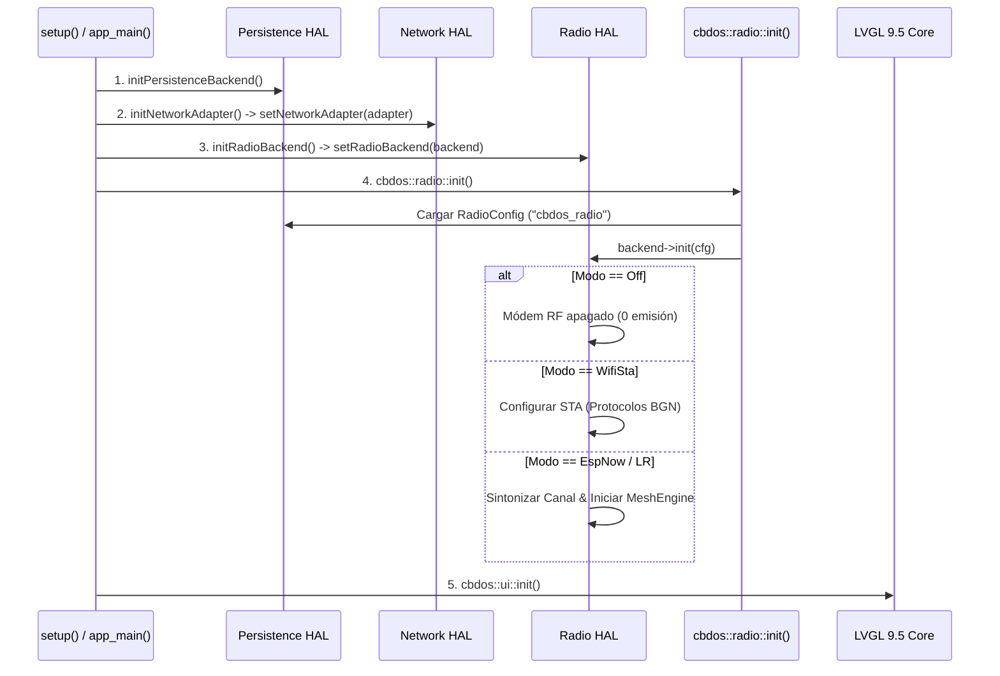

# 📡 Arquitectura de Abstracción de Radio y Red (HAL Multi-Target)

**Documento:** `docs/network/arquitectura_abstraccion_radio_y_red_hal.md`  
**Versión:** 1.0.0  
**Estado:** Implementado y Validado  
**Área:** Arquitectura Core / HAL / BSP Conectividad  

---

## 🏛️ 1. Visión General y Principios de Diseño

En **CBDos**, la conectividad inalámbrica se divide estrictamente en dos responsabilidades desacopladas:
1. **Control Físico del Silicio RF (`cbdos::radio` / `IRadioBackend`):** Encendido/apagado del módem 2.4 GHz, modulación (Wi-Fi STA, ESP-NOW Normal, ESP-NOW Long Range, Híbrido), canal RF (1..13), potencia de transmisión (+2..+20 dBm), escaneo Wi-Fi pasivo/activo y barridos multicanal (*Channel Hopping Sweep*).
2. **Capa de Red TCP/IP (`cbdos::network` / `INetworkAdapter`):** Asociación a Puntos de Acceso Wi-Fi (estático o DHCP), resolución de IP, estados de enlace (`NetStatus`) y métricas de señal (RSSI).

```
┌─────────────────────────────────────────────────────────────────────────────┐
│                          APLICACIONES Y UI (CORE)                           │
│   RadioConfigView  •  WiFiConfigView  •  DiagnosticsModal  •  QuickSettings │
└──────────────────────────────────────┬──────────────────────────────────────┘
                                       │ (Llamadas agnósticas de alto nivel)
┌──────────────────────────────────────▼──────────────────────────────────────┐
│                    DESPACHADORES AGNÓSTICOS (CORE)                          │
│     cbdos::radio (radio.cpp)        │     cbdos::network (network.cpp)      │
│  • Valida punteros y estado         │  • Valida punteros y estado           │
│  • Delega en IRadioBackend*         │  • Delega en INetworkAdapter*         │
│  • Carga RadioConfig desde NVS      │  • Fallback seguro ante nullptr       │
└──────────────────┬──────────────────┴───────────────────┬───────────────────┘
                   │ (Contratos C++ HAL)                  │
                   ▼                                      ▼
    ┌─────────────────────────────┐        ┌─────────────────────────────┐
    │     cbdos::radio::          │        │     cbdos::network::        │
    │     IRadioBackend           │        │     INetworkAdapter         │
    └──────────────┬──────────────┘        └──────────────┬──────────────┘
                   │                                      │
 ┌─────────────────┴──────────────────────────────────────┴──────────────────┐
 │                     INYECCIÓN EN TIEMPO DE ARRANQUE (BSP)                 │
 ├──────────────────────────────────────────┬────────────────────────────────┤
 │          ESP32-S3 (JC3248)               │          ESP32-P4 (JC4880)     │
 │  • S3RadioBackend (esp_wifi/esp_now)     │  • P4RadioBackend (Virtual C6) │
 │  • S3NetworkAdapter (Arduino WiFi.h)     │  • P4NetworkAdapter(ESP-Hosted)│
 └──────────────────────────────────────────┴────────────────────────────────┘
```

---

## 🚫 2. Ley de Pureza Arquitectónica (Zero Platform Pollution)

Siguiendo las reglas fundamentales de CBDos:
- **`core/` es 100% agnóstico:** Ningún archivo dentro de `core/` incluye cabeceras de hardware como `<WiFi.h>`, `<Arduino.h>`, `<esp_wifi.h>` o `<driver/...>`.
- **Sin directivas condicionales de plataforma:** Está prohibido usar `#ifdef ESP_PLATFORM` o `#ifdef ARDUINO` dentro del código de negocio de `core/`.
- **Inyección de Dependencias en el Arranque:** Los BSPs implementan los contratos abstractos y registran sus instancias únicas mediante `setNetworkAdapter()` y `setRadioBackend()`.
- **Offline-First Estricto:** Si no se detecta hardware de red o el módem está apagado, las llamadas a la API retornan valores seguros (`NetStatus::Disconnected`, `RadioMode::Off`, IP `"0.0.0.0"`, RSSI `-127 dBm`) sin provocar *null pointer dereference* ni bloquear el hilo de ejecución de la interfaz gráfica.

---

## 📐 3. Contratos e Interfaces C++ (`core/include/cbdos/`)

### 3.1. Adaptador de Red (`cbdos::network::INetworkAdapter`)

Ubicado en `core/include/cbdos/network.hpp`:

```cpp
namespace cbdos {
namespace network {

enum class NetStatus {
    Disconnected,
    Connecting,
    Connected,
    Error
};

class INetworkAdapter {
public:
    virtual ~INetworkAdapter() = default;

    virtual bool init() = 0;
    virtual bool connectWifi(const char* ssid, const char* password) = 0;
    virtual bool connectWifiStatic(const char* ssid, const char* password, const char* ip, const char* gateway, const char* subnet = "255.255.255.0", const char* dns = nullptr) = 0;
    virtual void disconnectWifi() = 0;
    virtual NetStatus getStatus() const = 0;
    virtual bool isConnected() const = 0;
    virtual std::string getIpAddress() const = 0;
    virtual int8_t getRssi() const = 0;
};

void setNetworkAdapter(INetworkAdapter* adapter);
INetworkAdapter* getNetworkAdapter();

// APIs públicas consumidas por UI y Core
bool init();
bool connectWifi(const char* ssid, const char* password);
bool connectWifiStatic(const char* ssid, const char* password, const char* ip, const char* gateway, const char* subnet = "255.255.255.0", const char* dns = nullptr);
void disconnectWifi();
NetStatus getStatus();
bool isConnected();
std::string getIpAddress();
int8_t getRssi();

} // namespace network
} // namespace cbdos
```

---

### 3.2. Backend de Radio (`cbdos::radio::IRadioBackend`)

Ubicado en `core/include/cbdos/radio.hpp`:

```cpp
namespace cbdos {
namespace radio {

enum class RadioMode {
    Off = 0,        // Radio apagada (Cero emisión RF, ahorro energético)
    WifiSta = 1,    // Wi-Fi Estación TCP/IP
    EspNow = 2,     // ESP-NOW Normal (1-2 Mbps)
    EspNowLR = 3,   // ESP-NOW Long Range (250 kbps, +20dBm)
    Hybrid = 4      // Híbrido (Wi-Fi STA + ESP-NOW en canal asociado)
};

struct WifiApInfo {
    std::string ssid;
    int8_t rssi = -127;
    uint8_t channel = 1;
    bool isEncrypted = false;
    std::string bssid;
};

struct DiscoveredNode {
    uint8_t mac[6] = {0};
    uint16_t short_id = 0;
    uint32_t uuid = 0;
    char name[32] = {0};
    uint8_t channel = 1;
    int8_t rssi = -127;
    uint8_t supported_modes = 0;
    uint32_t last_seen_ms = 0;
};

struct RadioConfig {
    bool enabled = true;
    RadioMode mode = RadioMode::EspNow;
    uint8_t channel = 1;
    int8_t txPower = 20; // +2 a +20 dBm
};

using WifiScanCallback = std::function<void(const std::vector<WifiApInfo>& aps, bool success)>;
using ChannelSweepCallback = std::function<void(uint8_t currentChannel, uint8_t totalChannels, const std::vector<DiscoveredNode>& nodes, bool finished)>;

class IRadioBackend {
public:
    virtual ~IRadioBackend() = default;

    virtual bool init(const RadioConfig& cfg) = 0;
    virtual bool setPower(bool on) = 0;
    virtual bool isPowered() const = 0;

    virtual bool setMode(RadioMode mode) = 0;
    virtual RadioMode getMode() const = 0;

    virtual bool setChannel(uint8_t channel) = 0;
    virtual uint8_t getChannel() const = 0;

    virtual bool setTxPower(int8_t dbm) = 0;
    virtual int8_t getTxPower() const = 0;

    virtual bool startWifiScan(WifiScanCallback cb) = 0;
    virtual bool startChannelSweep(ChannelSweepCallback cb) = 0;
    virtual void stopScan() = 0;
};

void setRadioBackend(IRadioBackend* backend);
IRadioBackend* getRadioBackend();

// APIs públicas consumidas por UI y Core
bool init();
bool isRadioPowered();
void setRadioPower(bool on);
bool setMode(RadioMode mode);
RadioMode getMode();
const char* getModeName(RadioMode mode);
uint8_t getChannel();
bool setChannel(uint8_t channel);
int8_t getTxPower();
bool setTxPower(int8_t dbm);
bool startWifiScan(WifiScanCallback cb);
bool startChannelSweep(ChannelSweepCallback cb);
void stopScan();

} // namespace radio
} // namespace cbdos
```

---

## ⚡ 4. Secuencia de Inicialización y Flujo de Arranque



---

## 📂 5. Mapa de Archivos e Implementaciones Concretas

| Módulo | Archivo | Responsabilidad |
| :--- | :--- | :--- |
| **Interfaz Red** | `core/include/cbdos/network.hpp` | Define el contrato `INetworkAdapter` y funciones públicas `cbdos::network::*`. |
| **Interfaz Radio** | `core/include/cbdos/radio.hpp` | Define el contrato `IRadioBackend` y funciones públicas `cbdos::radio::*`. |
| **Despachador Red** | `core/src/network/network.cpp` | Implementación agnóstica de `cbdos::network` delegando en `INetworkAdapter*`. |
| **Despachador Radio** | `core/src/network/radio.cpp` | Implementación agnóstica de `cbdos::radio` delegando en `IRadioBackend*`. |
| **BSP S3 Red** | `bsp/esp32_s3_jc3248/hal/hal_network_s3.cpp` | `S3NetworkAdapter`: Maneja `WiFi.h` de Arduino. |
| **BSP S3 Radio** | `bsp/esp32_s3_jc3248/hal/hal_radio_s3.cpp` | `S3RadioBackend`: Maneja `esp_wifi.h`, `esp_now.h` y tarea FreeRTOS de escaneo. |
| **BSP S3 Main** | `bsp/esp32_s3_jc3248/src/main.cpp` | Registra `initNetworkAdapterS3()` e `initRadioBackendS3()`. |
| **BSP P4 Red** | `bsp/esp32_p4_jc4880/hal/hal_network_p4.cpp` | `P4NetworkAdapter`: Maneja `esp_netif` y ESP-Hosted SDIO (C6). |
| **BSP P4 Radio** | `bsp/esp32_p4_jc4880/hal/hal_radio_p4.cpp` | `P4RadioBackend`: Implementación para arquitectura P4 + C6. |
| **BSP P4 Main** | `bsp/esp32_p4_jc4880/main/main.cpp` | Registra `initNetworkAdapterP4()` e `initRadioBackendP4()`. |

---

## 💻 6. Ejemplos de Uso para Desarrolladores de Aplicaciones

### 6.1. Conexión Wi-Fi Asíncrona desde UI

```cpp
#include "cbdos/network.hpp"
#include "cbdos/system.hpp"

void connectToNetwork(const std::string& ssid, const std::string& password) {
    if (ssid.empty()) return;

    cbdos::system::log(cbdos::system::LogLevel::Info, "App", "Conectando a %s...", ssid.c_str());
    
    // Inicia conexión en segundo plano sin bloquear el render de LVGL
    bool ok = cbdos::network::connectWifi(ssid.c_str(), password.c_str());
    if (!ok) {
        cbdos::system::log(cbdos::system::LogLevel::Error, "App", "Fallo al solicitar conexion");
    }
}

void checkConnection() {
    if (cbdos::network::isConnected()) {
        std::string ip = cbdos::network::getIpAddress();
        int8_t rssi = cbdos::network::getRssi();
        cbdos::system::log(cbdos::system::LogLevel::Info, "App", "Conectado. IP: %s (RSSI: %d dBm)", ip.c_str(), rssi);
    }
}
```

### 6.2. Cambio Dinámico de Modo y Canal de Radio

```cpp
#include "cbdos/radio.hpp"
#include "cbdos/config_manager.hpp"

void switchToLongRange(uint8_t channel) {
    // 1. Cambiar canal y modo
    cbdos::radio::setChannel(channel);
    cbdos::radio::setMode(cbdos::radio::RadioMode::EspNowLR);
    cbdos::radio::setTxPower(20); // +20 dBm

    // 2. Persistir configuración en NVS
    cbdos::radio::RadioConfig cfg;
    cfg.enabled = true;
    cfg.mode = cbdos::radio::RadioMode::EspNowLR;
    cfg.channel = channel;
    cfg.txPower = 20;
    cbdos::ConfigManager::getInstance().saveRadio(cfg);
}
```

---

## 🧪 7. Validación Multi-Target

| Entorno de Compilación | Comando de Validación | Estado |
| :--- | :--- | :--- |
| **ESP32-S3** (Arduino Core / PlatformIO) | `pio run -d bsp/esp32_s3_jc3248` | ✅ **PASS** (Compilación y enlace limpios) |
| **ESP32-P4** (ESP-IDF 5.5 / CMake / Ninja) | `. /home/kaber420/esp/esp-idf/export.sh && cd bsp/esp32_p4_jc4880 && idf.py build` | ✅ **PASS** (Generación completa de `cbdos_p4.bin`) |
