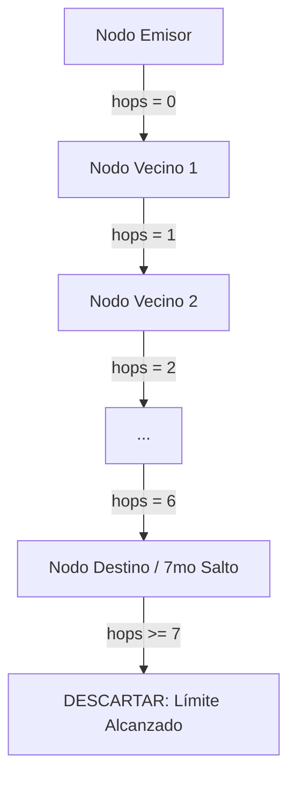

# Especificación Técnica y Auditoría de Enlace Módem USB, Framing y cbdBBS MeshCore

---

## 📌 1. Resumen Ejecutivo y Propósito

Este documento establece la **verdad técnica** del enlace entre el procesador principal (**ESP32-P4**), el coprocesador módem de radio USB (**ESP32-C3**), el nodo autónomo (**ESP32-S3**) y el motor descentralizado **cbdBBS (MeshCoreEngine)**.

Su objetivo es auditar, contrastar y documentar formalmente cada byte, trama de comunicación, callback y regla de identidad para evitar discrepancias entre la documentación y el código fuente real del proyecto **CBDos v0.2.1**.

---

## 🏗️ 2. Topología de Hardware y Flujo de Paquetes

```
┌────────────────────────────────────────────────────────────────────────┐
│                              ESP32-P4                                  │
│                                                                        │
│  +----------------------+     +-------------------------------------+  │
│  |  NetworkManagerView  |     |   MeshCoreView (App cbdBBS / Radar) |  │
│  +-----------+----------+     +------------------+------------------+  │
│              |                                   |                     │
│              v                                   v                     │
│  +──────────────────────────────────────────────────────────────────+  │
│  |         NetworkInterfaceManager (Slot 0, Slot 1, Slot 2)         |  │
│  +───────────────────────────────────+──────────────────────────────+  │
│                                      | (Slot 2)                        │
│                                      v                                 │
│  +──────────────────────────────────────────────────────────────────+  │
│  |            UsbCdcRadioTransport (bsp/esp32_p4_jc4880)            |  │
│  |      (Driver USB Host CDC-ACM: Hilo rxTaskLoop @ 12 Mbps)        |  │
│  +───────────────────────────────────+──────────────────────────────+  │
│                                      |                                 │
└──────────────────────────────────────┼─────────────────────────────────┘
                                       │ USB Tipo-C (Virtual COM CDC-ACM)
┌──────────────────────────────────────┼─────────────────────────────────┐
│                                      v                                 │
│  +──────────────────────────────────────────────────────────────────+  │
│  |            Firmware Bridge Módem USB (ESP32-C3 SuperMini)        |  │
│  |       (tools/espnow_usb_bridge: loop() + FrameParser + NVS)       |  │
│  +───────────────────────────────────+──────────────────────────────+  │
│                                      |                                 │
│                                      v (Radio ESP-NOW 2.4 GHz)         │
│                              (((( 📡 AIRE ))))                         │
│                                      ^                                 │
│                                      | (Radio ESP-NOW 2.4 GHz)         │
│  +───────────────────────────────────+──────────────────────────────+  │
│  |              S3NetworkInterface / EspNowS3Transport              |  │
│  |                   (bsp/esp32_s3_jc3248/hal)                      |  │
│  +───────────────────────────────────+──────────────────────────────+  │
│                                      |                                 │
│  +───────────────────────────────────v──────────────────────────────+  │
│  |               MeshCoreEngine (App cbdBBS / Radar S3)             |  │
│  +──────────────────────────────────────────────────────────────────+  │
│                              ESP32-S3                                  │
└────────────────────────────────────────────────────────────────────────┘
```

---

## 📡 3. Protocolo Binario de Enlace USB (`0xAA 0x55`)

La comunicación entre el ESP32-P4 y el ESP32-C3 utiliza tramas binarias con delimitador de inicio (`0xAA 0x55`), indicador de dirección (`DIR`), longitud de 2 bytes (`LEN_H`, `LEN_L`), carga útil (`Payload`) y suma de verificación `CRC8` (polinomio `0x8C`, estándar Dallas/Maxim).

### 3.1. Tipos de Tramas (`DIR`)
| Código | Macro | Dirección | Propósito |
|---|---|---|---|
| `0x01` | `DIR_PC_TO_DONGLE` | P4 $\rightarrow$ C3 | Paquete de datos crudo para ser transmitido al aire vía ESP-NOW Broadcast. |
| `0x02` | `DIR_DONGLE_TO_PC` | C3 $\rightarrow$ P4 | Paquete recibido del aire por ESP-NOW hacia el host P4. |
| `0x03` | `DIR_CTRL_CMD` | P4 $\rightarrow$ C3 | Comando de control de radio (Modo, Canal, Potencia, Alias, Estado). |
| `0x04` | `DIR_CTRL_RESP` | C3 $\rightarrow$ P4 | Respuesta estructurada al comando de control con telemetría de radio. |

---

### 3.2. Estructura de Tramas Byte a Byte

#### A) Emisión al Aire: `DIR_PC_TO_DONGLE` (`0x01`)
```
[0xAA] [0x55] [0x01] [LEN_H] [LEN_L] [ PAYLOAD CRUDA DE RADIO (N bytes) ] [CRC8]
```
* **Contrato:** El payload transmitido por el P4 debe ser **directamente la carga útil de radio** (ej. paquete MeshCore empezando con `0x4D43`).
* **Comportamiento en el C3:** El C3 toma los $N$ bytes de payload y ejecuta `esp_now_send(s_broadcast_mac, payload, len)`.

#### B) Recepción del Aire: `DIR_DONGLE_TO_PC` (`0x02`)
```
[0xAA] [0x55] [0x02] [LEN_H] [LEN_L] [SRC_MAC (6B)] [RSSI (1B)] [ PAYLOAD RECIBIDA (N-7 B) ] [CRC8]
```
* `LEN_TOTAL` = $7 + \text{Longitud del paquete recibido del aire}$.
* `SRC_MAC`: Dirección MAC de 6 bytes del nodo emisor en el aire.
* `RSSI`: Intensidad de señal en dBm con signo (`int8_t`, ej. `-45`).
* `PAYLOAD RECIBIDA`: Carga útil entregada por ESP-NOW a `onDataRecv()`.

#### C) Comando de Control: `DIR_CTRL_CMD` (`0x03`)
```
[0xAA] [0x55] [0x03] [LEN_H] [LEN_L] [CMD_ID (1B)] [PARAMS (N-1 B)] [CRC8]
```
* **Comandos Soportados:**
  * `0x01` (`RADIO_CMD_GET_STATUS`): Sin parámetros adicionales (`len = 1`).
  * `0x02` (`RADIO_CMD_SET_MODE`): Param: `0x01` (Normal 802.11 b/g/n) o `0x02` (Long Range LR).
  * `0x03` (`RADIO_CMD_SET_CHAN`): Param: Canal RF `1..13`.
  * `0x04` (`RADIO_CMD_SET_POWER`): Param: Potencia `1..84` (donde $84 = +20\text{ dBm}$).
  * `0x06` (`RADIO_CMD_SET_ALIAS`): Param: String con el nuevo alias para guardar en NVS.

#### D) Respuesta de Control: `DIR_CTRL_RESP` (`0x04`)
```
[0xAA] [0x55] [0x04] [LEN_H] [LEN_L] [CMD (1B)] [STATUS (1B)] [DATOS_RESPUESTA...] [CRC8]
```
* **Estructura para `RADIO_CMD_GET_STATUS` (`0x01`):**
  * `Byte 0`: `0x01` (`CMD_ID`)
  * `Byte 1`: `0x00` (`STATUS_OK`)
  * `Bytes 2..7`: `MAC Propia` (6 bytes del C3)
  * `Byte 8`: `Modo` (`0x01` = Normal, `0x02` = LR)
  * `Byte 9`: `Canal` (`1..13`)
  * `Byte 10`: `Potencia TX` (`1..84`)
  * `Byte 11`: `Peers Vistos` (número de nodos detectados por el dongle)
  * `Bytes 12..N`: `Alias` (string ASCII de hasta 31 caracteres, ej. `"PoP1a"`)

---

## 🧩 4. Arquitectura de Identidad y Direccionamiento cbdBBS

### 4.1. Generación de Identidad por Hardware
Para garantizar que cada dispositivo (P4, S3, C3, repetidores) sea un nodo único en la red sin colisiones y sin requerir servidores centrales de asignación:

$$\text{ShortID} = (\text{MAC}[4] \ll 8) \mid \text{MAC}[5]$$
$$\text{Nombre por Defecto} = \text{"CBDos-"} + \text{Hex}(\text{MAC}[4]) + \text{Hex}(\text{MAC}[5])$$

* **Ejemplo ESP32-P4 (`80:F1:B2:D1:7F:D5`):**
  * `ShortID`: `0x7FD5`
  * `Nombre`: `"CBDos-7FD5"`
* **Ejemplo ESP32-S3 (`9C:CC:01:7C:0C:94`):**
  * `ShortID`: `0x0C94`
  * `Nombre`: `"CBDos-0C94"`

### 4.2. Formato de Paquetes de Red cbdBBS (`MeshCoreEngine`)
Todo paquete de cbdBBS transportado por ESP-NOW inicia con el número mágico de 2 bytes `0x4D43` (`'MC'`):

#### A) Trama Baliza de Presencia (`PKT_BEACON` = `0x01`):
```
[0x43] [0x4D] [0x01] [HOPS] [SRC_ID_L] [SRC_ID_H] [0xFF] [0xFF] [0x00] [0x00] [NAME_LEN] [NOMBRE_NODO (N B)]
```
* Longitud mínima: $11\text{ bytes}$.
* Destino: `0xFFFF` (Broadcast a toda la malla).

#### B) Trama de Mensaje de Chat (`PKT_CHAT` = `0x02`):
```
[0x43] [0x4D] [0x02] [HOPS] [SRC_ID (2B)] [DST_ID (2B)] [CHAN_ID (2B)] [MSG_ID (4B)] [FLAGS (1B)] [PAYLOAD_LEN (1B)] [PAYLOAD...]
```
* Longitud de cabecera: $16\text{ bytes}$.
* `DST_ID`: `0xFFFF` para canal público o `ShortID` del destinatario para mensaje directo privado.
* `FLAGS`: Bit 0 = `1` (Payload cifrado con clave simétrica de canal), Bit 0 = `0` (Texto plano).

---

## 🔁 5. Algoritmo de Propagación y Enrutamiento Multi-Salto (7 Hops)



1. **Deduplicación Anti-Bucles:** Cada mensaje lleva un `MSG_ID` de 32 bits generado incrementalmente por el emisor. Los nodos mantienen un búfer circular de 128 identificadores vistos (`m_seenPacketIds`). Si `isPacketSeen(msgId)` es verdadero, el paquete se descarta de inmediato.
2. **Límite de Reenvío (TTL = 7 Saltos):**
   * Si `hops < 7` y el paquete no iba dirigido exclusivamente a la identidad local (`dstId != m_localShortId`), el nodo incrementa el campo `hops` en 1 y lo retransmite por todas sus demás interfaces activas (`forwardPacket()`).
   * Si `hops >= 7`, el paquete **no se reenvía más**, impidiendo la saturación del espectro de radio.

---

## 📋 6. Matriz de Mapeo de Ranuras Físicas

| Slot | Constante Enum | Implementación Hardware | Framework / Target |
|---|---|---|---|
| `Slot 0` | `Interface1_Internal` | Radio interna (C6 en P4 / S3 Integrada) | ESP-IDF (P4) / PlatformIO (S3) |
| `Slot 1` | `Interface2_Backpack` | Mochila LoRa SX1262 / SPI JP1 | SPI HAL nativo |
| `Slot 2` | `Interface3_USB` | Módem USB ESP32-C3 CDC-ACM | USB Host CDC-ACM (P4) |

---

## 🔍 7. Verificación y Auditoría de Código

| Requisito Técnico | Archivo Fuente | Estado de Conformidad |
|---|---|---|
| Framing limpio sin desfase de 6B | [`bsp/esp32_p4_jc4880/hal/hal_mesh_p4.cpp`](file:///home/kaber420/Documentos/proyectos/cbdos/bsp/esp32_p4_jc4880/hal/hal_mesh_p4.cpp) | ✅ Verificado y probado |
| Parsing completo de estado USB (Alias/Modo) | [`bsp/esp32_p4_jc4880/hal/hal_mesh_p4.cpp`](file:///home/kaber420/Documentos/proyectos/cbdos/bsp/esp32_p4_jc4880/hal/hal_mesh_p4.cpp) | ✅ Verificado y probado |
| Enlace dinámico de callbacks por slot | [`core/src/apps/meshcore/MeshCoreEngine.cpp`](file:///home/kaber420/Documentos/proyectos/cbdos/core/src/apps/meshcore/MeshCoreEngine.cpp) | ✅ Verificado y probado |
| Identidad única derivada de MAC | [`core/src/apps/meshcore/MeshCoreEngine.cpp`](file:///home/kaber420/Documentos/proyectos/cbdos/core/src/apps/meshcore/MeshCoreEngine.cpp) | ✅ Verificado y probado |
| Canal por defecto unificado a Canal 1 | [`bsp/esp32_s3_jc3248/hal/hal_radio_s3.cpp`](file:///home/kaber420/Documentos/proyectos/cbdos/bsp/esp32_s3_jc3248/hal/hal_radio_s3.cpp) | ✅ Verificado y probado |
| Interfaz UI con Alias y Modo en vivo | [`core/src/ui/views/NetworkManagerView.cpp`](file:///home/kaber420/Documentos/proyectos/cbdos/core/src/ui/views/NetworkManagerView.cpp) | ✅ Verificado y probado |
