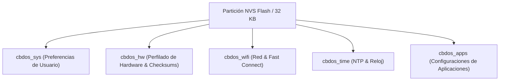

# 📑 Especificación Técnica: Persistencia NVS, Perfilado de Hardware & Fast Boot (CBDos)

**Fecha de Creación:** 20 de Agosto de 2026  
**Sistema Operativo:** CyBerDeck OS (CBDos v0.2.0)  
**Objetivo:** Guía y arquitectura de referencia para la persistencia de configuraciones de usuario, almacenamiento de metadatos de hardware descubiertos (*Hardware Profiling*) y aceleración de la secuencia de arranque (*Fast Boot*) en Flash NVS para microcontroladores ESP32-P4 y ESP32-S3.

---

## 🎯 1. Visión y Objetivos de Diseño

El almacenamiento no volátil (NVS Flash) en CBDos cumple dos propósitos fundamentales:
1. **Persistencia de la Experiencia de Usuario:** Mantener inmutables las preferencias (Brillo, Volumen, Red Wi-Fi, Zona Horaria, Tema).
2. **Fast Boot y Supresión de Sondeos Pesados (*Hardware Profiling*):** Guardar los parámetros descubiertos de los periféricos y coprocesadores en el primer arranque para evitar escaneos de buses I2C, negociaciones lentas de red o verificaciones redundantes en cada ciclo de encendido.

---

## 🗂️ 2. Mapa Oficial de Namespaces NVS

Para garantizar modularidad y evitar colisiones de claves, la memoria NVS de CBDos se organiza en 5 espacios de nombres (*namespaces*):



---

## 📋 3. Detalle de Variables por Namespace

### 3.1. `cbdos_sys` (Preferencias Globales del Sistema)
Almacena el estado visual, acústico y de comportamiento general del sistema operativo.

| Clave NVS | Tipo | Valor por Defecto | Descripción |
| :--- | :--- | :--- | :--- |
| `bright` | `uint8_t` | `70` | Porcentaje de retroiluminación PWM (10% - 100%). Evita calentamiento. |
| `vol` | `uint8_t` | `70` | Nivel maestro de salida de audio ES8311 (0% - 100%). |
| `wifi_auto` | `uint8_t` | `0` (false) | 0: Modo manual/offline seguro \| 1: Conectar Wi-Fi al iniciar en segundo plano. |
| `gmt_off` | `int32_t` | `-21600` | Desplazamiento respecto a UTC en segundos (-21600 = GMT-6). |
| `dst_off` | `int32_t` | `0` | Desplazamiento de horario de verano (segundos). |
| `scr_tout` | `uint32_t` | `60` | Tiempo de inactividad para suspender pantalla en segundos (0 = desactivado). |
| `theme` | `string` | `"dark"` | Identificador del tema activo (`"dark"`, `"cyberpunk"`, `"retro"`). |

---

### 3.2. `cbdos_hw` (Perfilado de Hardware, Checksums & Fast Boot)
*Variables técnicas para optimizar el arranque y suprimir comprobaciones repetitivas.*

| Clave NVS | Tipo | Valor Típico | Impacto / Ahorro en Arranque |
| :--- | :--- | :--- | :--- |
| `board_id` | `uint16_t` | `0x4880` (P4) / `0x3248` (S3) | Identificador de placa. Carga directa de controladores sin sondeos de pines. |
| `touch_i2c` | `uint8_t` | `0x5D` (GT911) / `0x14` | Dirección I2C del táctil verificada. Salta el barrido I2C inicial. |
| `c6_fw_crc` | `uint32_t` | CRC32 del binario C6 | Checksum del firmware del coprocesador C6. Evita entrar a modo bootloader para validar versiones. |
| `c6_fw_ver` | `string` | `"1.2.0-hosted"` | Cadena de versión del firmware ESP-Hosted esclavo. |
| `cal_x_min` | `int16_t` | `0` | Calibración de pantalla táctil X min. |
| `cal_x_max` | `int16_t` | `480` | Calibración de pantalla táctil X max. |
| `cal_y_min` | `int16_t` | `0` | Calibración de pantalla táctil Y min. |
| `cal_y_max` | `int16_t` | `800` | Calibración de pantalla táctil Y max. |
| `sys_prov` | `uint8_t` | `1` | Flag de primer arranque completado (*Provisioned*). Salta rutinas iniciales de formateo/directorios. |

---

### 3.3. `cbdos_wifi` (Red & Fast Connect)
Permite conectar al punto de acceso en milisegundos sin escanear canales de radio.

| Clave NVS | Tipo | Descripción |
| :--- | :--- | :--- |
| `ssid` | `string` | Nombre de la red Wi-Fi configurada. |
| `pass` | `string` | Contraseña de acceso encriptada/almacenada. |
| `channel` | `uint8_t` | Canal de radio conocido (1-13). **Fast Connect:** ahorra ~1.5 segundos de barrido. |
| `bssid` | `blob (6B)`| Dirección MAC física del router/AP para enlace directo. |
| `static_en` | `uint8_t` | 0: DHCP dinámico \| 1: IP Estática. |
| `ip` / `gw` / `sub` | `string` | Parámetros IP fijos en caso de uso estático. |

---

### 3.4. `cbdos_time` (Configuración del Servicio NTP)

| Clave NVS | Tipo | Valor por Defecto | Descripción |
| :--- | :--- | :--- | :--- |
| `server` | `string` | `"pool.ntp.org"` | Servidor NTP primario. |
| `offset` | `int32_t` | `-21600` | Desplazamiento UTC en segundos. |
| `dst` | `int32_t` | `0` | Horario de verano en segundos. |
| `enabled` | `uint8_t` | `1` | 1: Sincronización automática activa al conectar red. |

---

### 3.5. `cbdos_apps` (Ajustes de Aplicaciones)

| Clave NVS | Tipo | Aplicación | Descripción |
| :--- | :--- | :--- | :--- |
| `radio_last` | `uint16_t` | Radio Online | Índice de la última estación sintonizada. |
| `radio_favs` | `blob` | Radio Online | Lista de URLs de emisoras marcadas como favoritas. |
| `music_path` | `string` | Reproductor MP3 | Último directorio o archivo explorado en la MicroSD. |
| `synth_patch` | `uint8_t` | Sintetizador | Último preset de oscilador/filtro seleccionado. |

---

## ⚡ 4. Casos de Uso Avanzados para Fast Boot

### 4.1. Verificación Inteligente de Firmware del Coprocesador C6
```cpp
// Flujo futuro en FlasherView / NetworkManager:
uint32_t storedCrc = 0;
nvs_get_u32(hwHandle, "c6_fw_crc", &storedCrc);

uint32_t currentBinaryCrc = calculateEmbeddedFirmwareCrc();

if (storedCrc == currentBinaryCrc) {
    ESP_LOGI("Boot", "Coprocesador C6 al dia (CRC: 0x%08X). Omitiendo sondeo de flasheo.", storedCrc);
} else {
    ESP_LOGW("Boot", "Nueva version de firmware C6 detectada. Ofreciendo actualizacion...");
}
```

### 4.2. Fast Connect Wi-Fi (Conexión Directa en < 300 ms)
```cpp
// Al conectar exitosamente por primera vez:
wifi_ap_record_t ap_info;
if (esp_wifi_sta_get_ap_info(&ap_info) == ESP_OK) {
    nvs_set_u8(wifiHandle, "channel", ap_info.primary);
    nvs_set_blob(wifiHandle, "bssid", ap_info.bssid, 6);
    nvs_commit(wifiHandle);
}

// En el siguiente encendido (Fast Connect):
wifi_config_t wifi_cfg = {};
wifi_cfg.sta.channel = storedChannel; // Salta el escaneo de 13 canales
wifi_cfg.sta.bssid_set = 1;
memcpy(wifi_cfg.sta.bssid, storedBssid, 6);
esp_wifi_set_config(WIFI_IF_STA, &wifi_cfg);
esp_wifi_connect();
```

---

## 🛡️ 5. Reglas de Seguridad y Vida Útil de la Memoria Flash

1. **Escritura en Evento Liberado (`LV_EVENT_RELEASED`):**
   - Nunca escribir en NVS durante el desplazamiento continuo de un deslizador (`LV_EVENT_VALUE_CHANGED`).
   - Escribir únicamente cuando el usuario suelta el control táctil para no desgastar los bloques de la memoria Flash.
2. **Caché en RAM con Validación de Cambio (*Dirty Flag*):**
   - Si el valor nuevo es idéntico al valor en caché (`newValue == cachedValue`), se omite la operación `nvs_set_*` y `nvs_commit`.
3. **Resiliencia ante NVS Corrupta:**
   - Si `nvs_open()` o `nvs_get_*` devuelve error, `ConfigManager` siempre carga el valor por defecto seguro (ej. Brillo 70%, Volumen 70%, Offline seguro).
