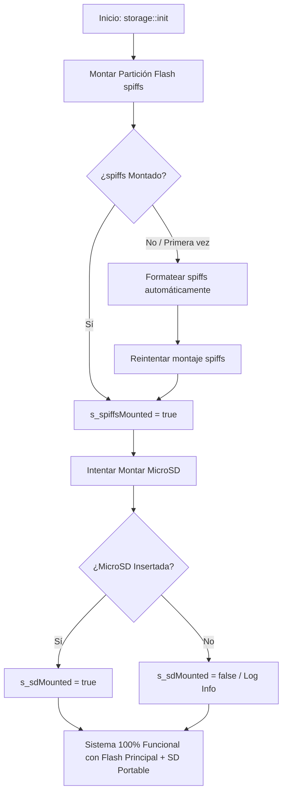

# 📋 Especificación Técnica Detallada: Refactorización de la Capa de Almacenamiento (Fase 2)
### *Almacenamiento VFS Flash (SPIFFS) Principal + MicroSD Portable + Persistencia MessagePack de Datos de Aplicación*

---

## 📌 1. Resumen Ejecutivo y Diagnóstico

### 1.1. Contexto tras la Fase 1
En la Fase 1 se desacopló con éxito la configuración escalar del sistema (**Persistencia NVS** mediante `IPersistenceBackend` y `ConfigManager`), logrando que brillo, volumen, hora y credenciales WiFi operen sin dependencias de plataforma en `core/` y compilen limpiamente en **ESP32-P4** y **ESP32-S3**.

### 1.2. Diagnóstico Técnico del Código Actual (Validado con OpenCode)
1. **Dependencia Exclusiva de MicroSD en los HALs:**
   * En [`hal_storage_p4.cpp`](file:///home/kaber420/Documentos/proyectos/cbdos/bsp/esp32_p4_jc4880/hal/hal_storage_p4.cpp) y [`hal_storage_s3.cpp`](file:///home/kaber420/Documentos/proyectos/cbdos/bsp/esp32_s3_jc3248/hal/hal_storage_s3.cpp), las funciones `readFile()`, `writeFile()`, `fileExists()` y `listDir()` solo operan si `s_sdMounted == true`.
   * Si el usuario enciende el dispositivo sin una MicroSD insertada, **todas las operaciones de almacenamiento fallan**, impidiendo guardar listas de radio, configuraciones de temas o notas.
2. **Partición `spiffs` de Flash Interna No Montada:**
   * Aunque la tabla de particiones de 16 MB ya incluye la partición **`spiffs`** (**4 MB** en S3 `custom_16MB_ota.csv` y **2 MB** en P4 `partitions.csv`), ningún HAL la monta al inicio del sistema.
3. **Ajustes de Configuración Pendientes en Builds:**
   * **ESP32-P4:** Falta habilitar `CONFIG_SPIFFS_SUPPORT=y` en `sdkconfig.defaults`.
   * **ESP32-S3:** Falta incluir `SPIFFS` en `lib_deps` del entorno principal `[env:esp32s3]` en `platformio.ini`.
4. **Acoplamiento Fuerte en `RadioManager.cpp`:**
   * Contiene bloques `#if defined(ARDUINO)`, inclusiones directas de `<ArduinoJson.h>`, `<cJSON.h>`, `<SD.h>` y llamadas a rutas rígidas (`/sdcard/audio/radios.json`), violando la **Ley de Pureza Arquitectónica de `core/` (Regla 8)**.

---

## 🏛️ 2. Arquitectura de Almacenamiento

El sistema operará bajo una jerarquía clara donde la **Memoria Flash Interna es el Almacenamiento Principal y Permanente**:

```
┌─────────────────────────────────────────────────────────────────────────┐
│                       CAPA DE APLICACIONES (Core)                       │
│           (Radio Web, Wallpapers, Editor de Texto, Cartuchos)           │
└────────────────────────────────────┬────────────────────────────────────┘
                                     │
                                     ▼
┌─────────────────────────────────────────────────────────────────────────┐
│                      cbdos::storage (VFS Agnóstico)                     │
│    • readFile()  • writeFile()  • listDir()  • fileExists()  • copy()   │
│    • Enrutamiento automático por prefijo de ruta                        │
└───────────────────┬─────────────────────────────────┬───────────────────┘
                    │                                 │
                    ▼ (Rutas: /spiffs/... o relativo) ▼ (Rutas: /sd/... o /sdcard)
┌───────────────────────────────────────┐ ┌───────────────────────────────┐
│       PARTICIÓN FLASH INTERNA         │ │        TARJETA MicroSD        │
│        Partición 'spiffs'             │ │     Slot 0 / SDMMC / SPI      │
├───────────────────────────────────────┤ ├───────────────────────────────┤
│ == ALMACENAMIENTO PRINCIPAL (2-4 MB) ==│ │ == MEDIO PORTABLE SECUNDARIO ==│
│ • Montaje garantizado en arranque     │ │ • Unidad extraíble (hot-plug) │
│ • Datos del sistema (listas, notas)   │ │ • Importación / Exportación   │
└───────────────────────────────────────┘ └───────────────────────────────┘
```

### 2.1. Tabla Oficial de Particiones y Puntos de Montaje

| Medio | Partición Física | Offset / Tamaño | Punto de Montaje VFS | Alias Soportados | Jerarquía del Sistema |
| :--- | :--- | :--- | :--- | :--- | :--- |
| **Flash Interna** | `spiffs` | `0xB10000` (4 MB S3) / `0xC10000` (2 MB P4) | **`/spiffs`** | `/flash` | **Almacenamiento Principal.** Permanente, soldado y siempre disponible. |
| **MicroSD Externa** | Slot MicroSD | Variable (FAT32) | **`/sd`** | `/sdcard`, `A:/` | **Almacenamiento Secundario.** Unidad extraíble para intercambio de datos. |

---

## ⚙️ 3. Inicialización y Enrutamiento en `cbdos::storage`

### 3.1. Proceso de Arranque en `storage::init()`



### 3.2. Tabla de Resolución de Rutas (Path Router)

Toda función de `cbdos::storage` resolverá el destino físico del archivo según las siguientes reglas:

1. **Ruta relativa (sin barra inicial, ej. `"audio/playlists.msgpack"`):**
   * Se antepone automáticamente el prefijo `/spiffs/`, garantizando que **todas las aplicaciones guarden sus datos en la memoria interna permanente del sistema**.
2. **Ruta con prefijo `/spiffs/` o `/flash/`:**
   * Se dirige al driver de la Flash interna.
3. **Ruta con prefijo `/sd/`, `/sdcard/` o `A:/`:**
   * Se dirige al driver de la tarjeta MicroSD (comprobando `s_sdMounted`).

---

## 💾 4. Modelo de Datos de Radio y Serialización MessagePack

### 4.1. Estructuras de Datos (`core/src/audio/RadioManager.hpp`)

```cpp
namespace cbdos {
namespace audio {

struct RadioStation {
    std::string name;       // Nombre de la emisora (ej: "SomaFM Groove Salad")
    std::string url;        // URL del stream HTTP/HTTPS
    std::string country;    // País (ej: "USA", "España", "Global")
    std::string genre;      // Género (ej: "Ambient", "Synthwave")
    int bitrate = 128;      // Bitrate estimado
    bool isFavorite = false;
};

struct RadioPlaylist {
    std::string id;         // Identificador único (ej: "fav", "pl_retro")
    std::string name;       // Nombre visible (ej: "Favoritos", "Synthwave")
    std::vector<RadioStation> stations;
    bool isDefault = false; // true para la lista protegida "Favoritos"
};

} // namespace audio
} // namespace cbdos
```

### 4.2. Estrategia de Vida Útil de la Flash (Dirty-Flag en RAM)
* Las listas de radio se cargan completas a memoria RAM al iniciar el sistema.
* Al añadir, borrar o editar emisoras, se marca una bandera `m_dirty = true` y se guarda en `/spiffs/playlists.msgpack`.
* Esto previene escrituras repetitivas y prolonga la vida útil de la memoria Flash NOR (~100,000 ciclos).

### 4.3. Portabilidad con MicroSD (Importar / Exportar)
* **Exportar Lista:** `RadioManager::exportPlaylistToSd(playlistId, "/sd/playlists/nombre.msgpack")`
  * Toma la lista desde la Flash interna y la escribe en la tarjeta MicroSD.
* **Importar Lista:** `RadioManager::importPlaylistFromSd("/sd/playlists/nombre.msgpack")`
  * Lee el archivo desde la MicroSD y agrega la lista a la base de datos de la Flash interna.
* **Soporte M3U:** `RadioManager::importM3uFromSd("/sd/playlists/radios.m3u")`
  * Parsea archivos de texto estándar `#EXTINF:` para compatibilidad universal con listas de internet.

---

## 🛠️ 5. Plan de Ejecución Paso a Paso

### Paso 1: Configuración de Entornos de Compilación
* **ESP32-P4 (`bsp/esp32_p4_jc4880/sdkconfig.defaults`):**
  * Habilitar `CONFIG_SPIFFS_SUPPORT=y`, `CONFIG_SPIFFS_MAX_PARTITIONS=1`, `CONFIG_SPIFFS_PAGE_SIZE=256`, `CONFIG_SPIFFS_OBJ_NAME_LEN=32`.
* **ESP32-S3 (`bsp/esp32_s3_jc3248/platformio.ini`):**
  * Agregar `SPIFFS` a `lib_deps` en `[env:esp32s3]`.

### Paso 2: Extensión de la API de Almacenamiento (`core/include/cbdos/storage.hpp`)
* Añadir declaraciones agnósticas:
  ```cpp
  bool isFlashMounted();
  bool isSdMounted();
  bool copyFile(const char* srcPath, const char* dstPath);
  bool makeDir(const char* path);
  ```

### Paso 3: Implementación de Montaje SPIFFS y Enrutador en ESP32-P4 (`hal_storage_p4.cpp`)
* Montar partición `spiffs` con `esp_vfs_spiffs_register()`.
* Implementar `normalizePath()` con enrutamiento de prefijo (`/spiffs` vs `/sdcard`).
* Asegurar que `readFile()`, `writeFile()`, `fileExists()`, `deleteFile()` y `listDir()` operen de forma transparente.

### Paso 4: Implementación de Montaje SPIFFS y Enrutador en ESP32-S3 (`hal_storage_s3.cpp`)
* Montar partición `spiffs` con `SPIFFS.begin(false, "/spiffs")`.
* Implementar `normalizePath()` con enrutamiento de prefijo (`/spiffs` vs `/sdcard`).
* Asegurar que `readFile()`, `writeFile()`, `fileExists()`, `deleteFile()` y `listDir()` operen de forma transparente.

### Paso 5: Refactorización de `RadioManager` (`core/src/audio/`)
* Eliminar de `RadioManager.cpp`: `<ArduinoJson.h>`, `<cJSON.h>`, `<SD.h>`, y bifurcaciones `#if defined(ARDUINO)`.
* Implementar serialización MessagePack nativa sobre `cbdos::storage`.
* Añadir soporte de importación/exportación hacia MicroSD.

### Paso 6: Verificación Multi-Target y Pruebas
* Compilación limpia en **ESP32-P4** (`idf.py build`).
* Compilación limpia en **ESP32-S3** (`pio run -d bsp/esp32_s3_jc3248`).
